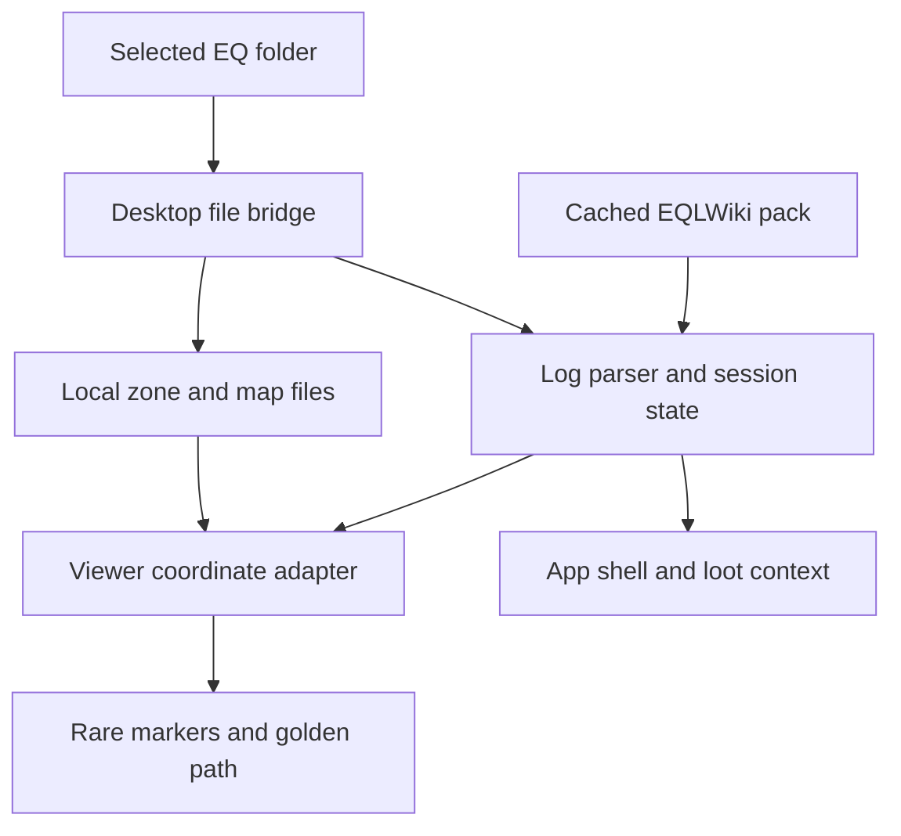

# Eye of Zomm contributor handoff

This repository is the source of truth. A new contributor should be able to resume from this page without prior chat history.

## Start here

1. Read the [product and UX vision](UX_VISION.md) for the approved experience, user stories, acceptance contracts, and ordered road to v1.
2. Read [implementation status](IMPLEMENTATION_STATUS.md) for what is shipped, what still needs real-client evidence, and the exact next task.
3. Run the automated gates in [VALIDATION.md](../VALIDATION.md), then use the [v0.7 Windows/game-client checklist](V0.7_MANUAL_TEST.md) for proprietary archives the repository cannot contain.
4. Check [CHANGELOG.md](../CHANGELOG.md) for the current code version and [SAFETY.md](../SAFETY.md) before changing any game-facing data flow.

Current code baseline: **0.7.1**. The 0.7 replacement-map loop is implemented. The first 0.8 slices add live remaining distance, next-turn/facing cues, redacted support diagnostics, and a deterministic topology corpus with eight expected route/no-route outcomes. The collision graph remains the current pathfinder until geometry-backed corpus execution and a reviewed Recast/Detour worker are ready.

## Run and verify

Requirements are Node.js 22+ and a normal EverQuest Legends installation for real map validation.

```bash
npm ci
npm test
npm run test:catalog
npm start
```

`npm run test:catalog` needs a production bootstrap pack. Fetch and validate it first when it is absent:

```bash
node scripts/fetch-bootstrap-pack.mjs --required
npm run test:catalog
```

Do not commit proprietary S3D/EQG archives, player logs, exported diagnostics, or the generated bootstrap pack.

## Runtime architecture

The desktop process in [`desktop/main.cjs`](../desktop/main.cjs) owns the selected EverQuest root, safe loopback file bridge, log selection, cached dataset, and Electron window. [`app/app.js`](../app/app.js) consumes that bridge, parses appended log text with [`app/parser.js`](../app/parser.js), derives the session UI, and coordinates the embedded viewer.

The embedded wrapper in [`app/zoneviewer/viewer.html`](../app/zoneviewer/viewer.html) adapts `/loc`, EQLWiki coordinates, local map labels, and viewer geometry into one map basis. The upstream-derived viewer implementation stays under [`app/zoneviewer/`](../app/zoneviewer/). Movement constraints live in [`app/navigation-policy.js`](../app/navigation-policy.js); pure turn/distance behavior lives in [`app/route-guidance.js`](../app/route-guidance.js).



The app is read-only with respect to EverQuest. It may consume `/loc` lines produced by user-created game bindings; it must never emit input, issue game commands, inspect memory, inject code, or automate route following.

## Data sources and external references

- Production data is built by [`server/BuildEyeOfZommPack.php`](../server/BuildEyeOfZommPack.php) and mirrored on the repository's `dataset` branch. The client never crawls EQLWiki pages.
- No EQLWiki archive ZIP or EQEmu source checkout is required or stored in this repository.
- The spatial design cites EQEmu's public [Detour pathfinder](https://github.com/EQEmu/EQEmu/blob/master/zone/pathfinder_nav_mesh.cpp) and [map raycasts](https://github.com/EQEmu/EQEmu/blob/master/zone/map.cpp) only as conceptual references. Eye of Zomm keeps its own read-only viewer boundary.

## Exact next work

Continue section 16.3 of the vision in this order:

1. Extend the topology cases in [`app/route-corpus.js`](../app/route-corpus.js) with redistributable triangle/collision geometry that both the current pathfinder adapter and a prospective Recast adapter can consume.
2. Evaluate a maintained, license-compatible Recast/Detour WebAssembly implementation and record dependency license, provenance, maintenance, bundle size, and security review.
3. Prototype generation/query work in a worker behind a route-engine adapter, then run the same corpus against the reference router and the prototype.
4. Record proprietary real-zone cases only as redacted expectations in the manual matrix; never commit archives or coordinates that expose a player identity.
5. Keep the current collision graph as fallback and require every rendered segment to pass existing collision and directed elevation validation.

Do not start durable history or upgrade scoring from 0.9 until the 0.8 route corpus is in place; it is the evidence gate for changing pathfinding.

## Release path

- Every change must keep `npm test` green. Catalog-affecting changes must also pass `npm run test:catalog` against the verified production pack.
- Pushes to `main` run CI and the Windows build workflow. A `vX.Y.Z` tag runs the release workflow.
- Keep `package.json`, `package-lock.json`, CHANGELOG, validation notes, and installer filename expectations on the same version.
- Trusted Authenticode signing is required for 1.0. Until certificates are configured, workflows may produce a clearly identified unsigned 0.x installer.
- Before tagging, complete the Windows/game-client checklist. Repository tests cannot validate proprietary zone textures, stacked-floor placement, label alignment, or subjective route quality.

When handing off again, update the baseline and **Exact next work** here, the matching status row in [IMPLEMENTATION_STATUS.md](IMPLEMENTATION_STATUS.md), and the implementation note in vision section 16.
