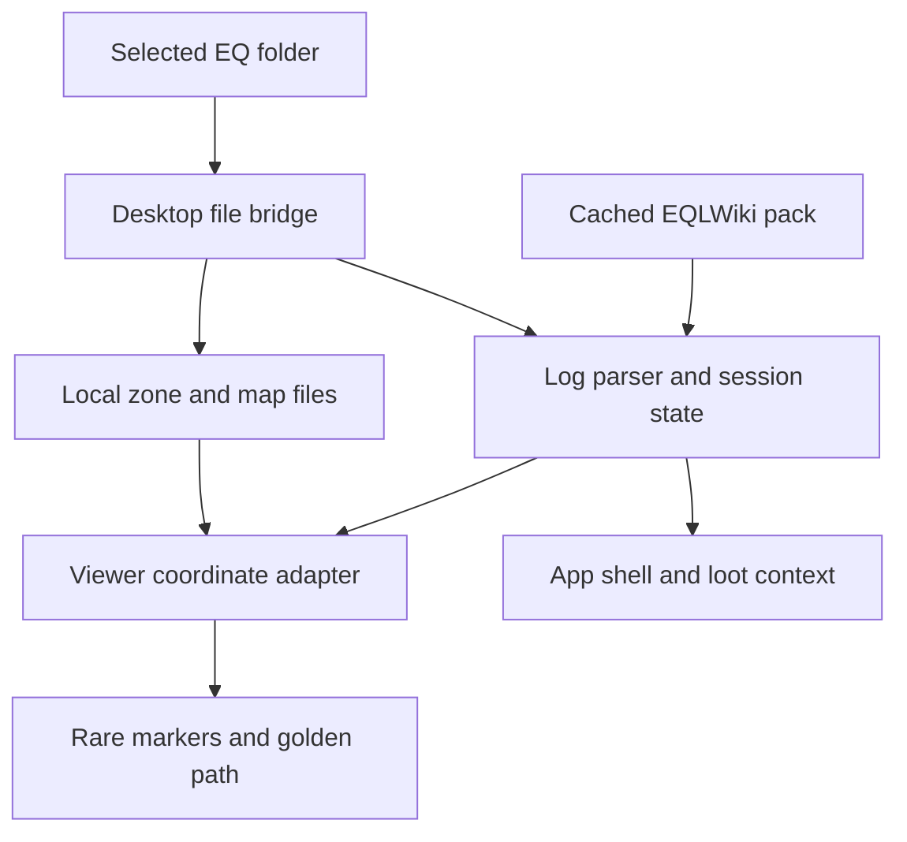

# Eye of Zomm contributor handoff

This repository is the source of truth. A new contributor should be able to resume from this page without prior chat history.

## Start here

1. Read the [product and UX vision](UX_VISION.md) for the approved experience, user stories, acceptance contracts, and ordered road to v1.
2. Read [implementation status](IMPLEMENTATION_STATUS.md) for what is shipped, what still needs real-client evidence, and the exact next task.
3. Run the automated gates in [VALIDATION.md](../VALIDATION.md), then use the [v0.7 Windows/game-client checklist](V0.7_MANUAL_TEST.md) for proprietary archives the repository cannot contain.
4. Check [CHANGELOG.md](../CHANGELOG.md) for the current code version and [SAFETY.md](../SAFETY.md) before changing any game-facing data flow.

Current code baseline: **0.7.8**. The replacement-map loop now uses one fly-first viewer control row, a pop-out Z slicer, reset-to-Succor, worker-first production route searches, and cancellation that clears the owning route state. NPC-name `/waypoint` copying and presentation-safe route starts remain intact. The Befallen/Mistmoore alignment incidents are covered through explicit logged/wiki, world, client-map-file, in-game-Map-readout, and viewer adapters in `app/coordinate-system.js`; do not collapse them into one generic map transform. Client map files use `(-world X,-world Y,Z)` without an X/Y swap. Map is intentionally `.txt` line art, while First/Top are the S3D texture acceptance surfaces. The 0.7.8 parser broadens material aliases and forces repeating WLD texture sampling; it still requires proprietary-zone visual confirmation. The pinned Recast/Detour worker remains dormant until real-zone collision export passes.

The parser also treats the current character's Legends `/who` row as an authoritative zone signal. It strips the volatile instance number, retains the parenthesized short name for catalog/archive matching, ignores other players, and suppresses repeat-zone reloads. Keep the exact capture in `tests/test.mjs` when extending this grammar.

When multiple map families exist under the installation, `mapFamilyForZone` prefers the root `maps` directory so it matches the client's `default` map dropdown. The sync footer names the selected map set. Do not return to the prior byte-size heuristic; add an explicit user-facing selector before allowing a custom folder to win.

## Run and verify

Requirements are Node.js 22+ and a normal EverQuest Legends installation for real map validation.

```bash
npm ci
npm test
npm run test:catalog
npm start
```

`npm run test:catalog` needs a production bootstrap pack. Fetch and validate it first when it is absent:

```bash
node scripts/fetch-bootstrap-pack.mjs --required
npm run test:catalog
```

Do not commit proprietary S3D/EQG archives, player logs, exported diagnostics, or the generated bootstrap pack.

## Runtime architecture

The desktop process in [`desktop/main.cjs`](../desktop/main.cjs) owns the selected EverQuest root, safe loopback file bridge, log selection, cached dataset, and Electron window. [`app/app.js`](../app/app.js) consumes that bridge, parses appended log text with [`app/parser.js`](../app/parser.js), derives the session UI, and coordinates the embedded viewer.

[`app/coordinate-system.js`](../app/coordinate-system.js) is the authoritative boundary: log/wiki `(Y,X,Z)` → world `(X,Y,Z)`; client map `(-X,-Y,Z)` and world/WLD both meet in viewer `(-Y,Z,X)`. Visible coordinate text converts canonical world positions back to `/loc (Y,X,Z)` and must never expose internal axis labels. The embedded wrapper in [`app/zoneviewer/viewer.html`](../app/zoneviewer/viewer.html) applies those named adapters. The upstream-derived viewer implementation stays under [`app/zoneviewer/`](../app/zoneviewer/). Movement constraints live in [`app/navigation-policy.js`](../app/navigation-policy.js); pure turn/distance behavior lives in [`app/route-guidance.js`](../app/route-guidance.js). The candidate boundary is split between [`app/recast-route-client.js`](../app/recast-route-client.js), [`app/recast-route-engine.js`](../app/recast-route-engine.js), and the independent [`app/route-validation.js`](../app/route-validation.js) guard.



The app is read-only with respect to EverQuest. It may consume `/loc` lines produced by user-created game bindings; it must never emit input, issue game commands, inspect memory, inject code, or automate route following.

## Data sources and external references

- Production data is built by [`server/BuildEyeOfZommPack.php`](../server/BuildEyeOfZommPack.php) and mirrored on the repository's `dataset` branch. The client never crawls EQLWiki pages.
- No EQLWiki archive ZIP or EQEmu source checkout is required or stored in this repository.
- The spatial design cites EQEmu's public [Detour pathfinder](https://github.com/EQEmu/EQEmu/blob/master/zone/pathfinder_nav_mesh.cpp) and [map raycasts](https://github.com/EQEmu/EQEmu/blob/master/zone/map.cpp) only as conceptual references. Eye of Zomm keeps its own read-only viewer boundary.

## Exact next work

Continue section 16.3 of the vision in this order:

1. Run the 0.7.8 S3D check in Mistmoore plus one outdoor zone. Confirm materials tile rather than stretch and compare the redacted available/material/resolved counts. If it still fails, preserve the screenshot, zone short name, counts, and material names—never game archives.
2. Export the decoded viewer collision triangles through the existing single EQ-to-viewer coordinate boundary; do not add a second transform inside the route engine.
3. Feed that real-zone geometry to the Recast worker client without blocking zone rendering, and key requests by zone/destination/location so stale results cannot replace newer guidance.
4. Keep the worker-first, collision-projected production route visible; swap in a candidate result only after `route-validation.js` approves it, without changing First/Top/Map, Z slice, zoom, or minimal/full choices.
5. Add redacted real-zone timing/outcome fields to diagnostics and cover stacked floor, ramp, closed door, and drop cases in the Windows checklist. Never commit archives, raw logs, or identity-bearing coordinates.
6. If the real-zone matrix passes, make Recast the preferred engine with automatic worker-line fallback. Otherwise keep it dormant and record the failing fixture category.

Do not start durable history or upgrade scoring from 0.9 until the decoded real-zone integration above passes the 0.8 Windows matrix. The synthetic route corpus is already in place; real-zone collision export, candidate validation, responsiveness, and fallback evidence are the remaining pathfinding gate.

## Release path

- Every change must keep `npm test` green. Catalog-affecting changes must also pass `npm run test:catalog` against the verified production pack.
- Pushes to `main` run CI and the Windows build workflow. After all gates, the first successful build for each new `0.x` package version creates a versioned GitHub prerelease; later commits with that same version preserve its tag and only upload the temporary Actions artifact. A matching `vX.Y.Z` tag runs the explicit release workflow, which also classifies `0.x` and semantic prerelease versions as prereleases. Both Windows workflows inspect the built ASAR with `npm run test:artifact`; never publish an installer that has not passed that package/source/version check.
- Keep `package.json`, `package-lock.json`, CHANGELOG, validation notes, and installer filename expectations on the same version.
- Trusted Authenticode signing is required for 1.0. Until certificates are configured, workflows may produce a clearly identified unsigned 0.x installer.
- Before tagging, complete the Windows/game-client checklist. Repository tests cannot validate proprietary zone textures, stacked-floor placement, label alignment, or subjective route quality.

When handing off again, update the baseline and **Exact next work** here, the matching status row in [IMPLEMENTATION_STATUS.md](IMPLEMENTATION_STATUS.md), and the implementation note in vision section 16.
