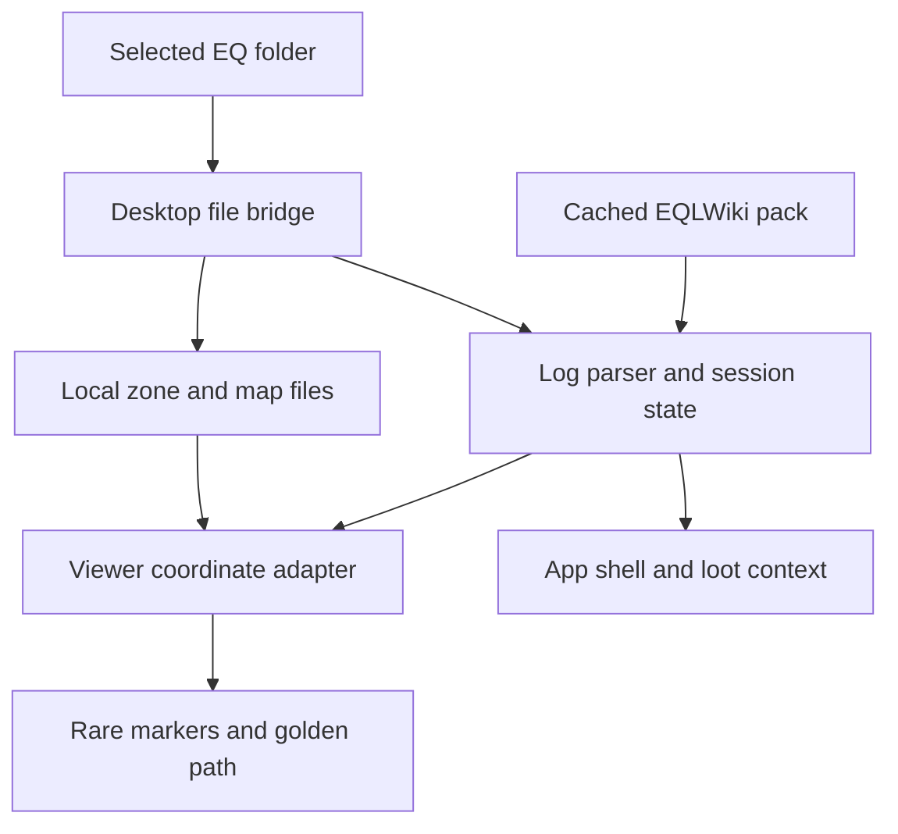

# Eye of Zomm contributor handoff

This repository is the source of truth. A new contributor should be able to resume from this page without prior chat history.

## Start here

1. Read the [product and UX vision](UX_VISION.md) for the approved experience, user stories, acceptance contracts, and ordered road to v1.
2. Read [implementation status](IMPLEMENTATION_STATUS.md) for what is shipped, what still needs real-client evidence, and the exact next task.
3. Run the automated gates in [VALIDATION.md](../VALIDATION.md), then use the [Windows/game-client checklist](WINDOWS_MANUAL_TEST.md) for proprietary archives the repository cannot contain.
4. Check [CHANGELOG.md](../CHANGELOG.md) for the current code version and [SAFETY.md](../SAFETY.md) before changing any game-facing data flow.

Current code baseline: **0.8.0**. Minimal view is intel-first: named/rare mobs are the default surface, with no duplicate destination field, while map and row-level routing are independent opt-in Settings choices that default off. Waypoint copying, considers, pop-under loot, and mob-list filtering remain active without either. Class-filtered loot excludes statless and weight-only items.

Desktop zone indexing remains metadata-only and hydrates the selected archive on demand. The WLD exporter advances across skipped material groups so later textures stay assigned to their actual polygon ranges; bitmap aliases and repeating UV sampling remain in place. EQEmu's sequential WLD polygon/material assignment independently supports this repair, but Mistmoore plus one outdoor proprietary-zone visual check is still required.

The pinned Recast/Detour worker is now a guarded integration candidate, not a dormant prototype. The established line-map worker builds and collision-projects the first usable route. In parallel, the wrapper exports decoded viewer collision triangles, crops them around that route, and transfers the route-local buffers to Recast. Only a complete candidate that passes independent surface and directed-elevation validation replaces the rendered ribbon. Candidate preparation never clears the established line or destination, and real Windows/game-client evidence is still required before Recast becomes first-choice routing.

The parser also treats the current character's Legends `/who` row as an authoritative zone signal. It strips the volatile instance number, retains the parenthesized short name for catalog/archive matching, ignores other players, and suppresses repeat-zone reloads. Keep the exact capture in `tests/test.mjs` when extending this grammar.

When multiple map families exist under the installation, `mapFamilyForZone` prefers the root `maps` directory so it matches the client's `default` map dropdown. The sync footer names the selected map set. Do not return to the prior byte-size heuristic; add an explicit user-facing selector before allowing a custom folder to win.

## Run and verify

Requirements are Node.js 22+ and a normal EverQuest Legends installation for real map validation.

```bash
npm ci
npm test
npm run test:catalog
npm start
```

`npm run test:catalog` needs a production bootstrap pack. Fetch and validate it first when it is absent:

```bash
node scripts/fetch-bootstrap-pack.mjs --required
npm run test:catalog
```

Do not commit proprietary S3D/EQG archives, player logs, exported diagnostics, or the generated bootstrap pack.

## Runtime architecture

The desktop process in [`desktop/main.cjs`](../desktop/main.cjs) owns the selected EverQuest root, safe loopback file bridge, log selection, cached dataset, and Electron window. [`app/app.js`](../app/app.js) consumes that bridge, parses appended log text with [`app/parser.js`](../app/parser.js), derives the session UI, and coordinates the embedded viewer.

[`app/coordinate-system.js`](../app/coordinate-system.js) is the authoritative boundary: log/wiki `(Y,X,Z)` → world `(X,Y,Z)`; client map `(-X,-Y,Z)` and world/WLD both meet in viewer `(-Y,Z,X)`. Visible coordinate text converts canonical world positions back to `/loc (Y,X,Z)` and must never expose internal axis labels. The embedded wrapper in [`app/zoneviewer/viewer.html`](../app/zoneviewer/viewer.html) applies those named adapters. The upstream-derived viewer implementation stays under [`app/zoneviewer/`](../app/zoneviewer/). Movement constraints live in [`app/navigation-policy.js`](../app/navigation-policy.js); pure turn/distance behavior lives in [`app/route-guidance.js`](../app/route-guidance.js).

Spatial candidate ownership is intentionally split at testable boundaries:

- [`app/collision-geometry.js`](../app/collision-geometry.js) flattens `zoneGroup` collision meshes after `matrixWorld`, preserves winding under mirrored transforms, skips props/pass-through/degenerate triangles, yields during large exports, and crops a bounded corridor around the established route.
- [`app/recast-route-client.js`](../app/recast-route-client.js) transfers ephemeral crop buffers, enforces latest-request-wins, terminates stale/failed/timed-out workers, and resolves every failure as fallback rather than throwing away the current route.
- [`app/recast-route-engine.js`](../app/recast-route-engine.js) generates and queries the navmesh in the dedicated bundled worker, rejects partial goals, and uses the shared +6 climb policy.
- [`app/route-validation.js`](../app/route-validation.js) builds a worker-local X/Z triangle index, projects the sparse result back onto supplied triangles, and independently fails closed on unsupported segments, undeclared drops, and excessive upward climbs. Large triangles that span many cells stay in a broad-triangle bucket; retain that fallback when tuning the index.
- [`app/diagnostics.js`](../app/diagnostics.js) exposes only allow-listed aggregate collision/candidate status, counts, timings, and reasons under diagnostics schema v2. Location readiness is boolean. Do not add character/target identity, player or route coordinates, path points, raw worker error detail, or local paths.



The app is read-only with respect to EverQuest. It may consume `/loc` lines produced by user-created game bindings; it must never emit input, issue game commands, inspect memory, inject code, or automate route following.

## Data sources and external references

- Production data is built by [`server/BuildEyeOfZommPack.php`](../server/BuildEyeOfZommPack.php) and mirrored on the repository's `dataset` branch. The client never crawls EQLWiki pages.
- No EQLWiki archive ZIP or EQEmu source checkout is required or stored in this repository.
- The spatial design cites EQEmu's public [Detour pathfinder](https://github.com/EQEmu/EQEmu/blob/master/zone/pathfinder_nav_mesh.cpp) and [map raycasts](https://github.com/EQEmu/EQEmu/blob/master/zone/map.cpp) only as conceptual references. Eye of Zomm keeps its own read-only viewer boundary.
- EQEmu's deprecated but directly relevant [azone2 WLD exporter](https://github.com/EQEmu/EQEmu/blob/master/utils/deprecated/azone2/wld.cpp) assigns each material group's `polycount` to the next sequential polygons. That is corroborating evidence for the skipped-material cursor repair, not a replacement for proprietary client rendering tests.

## Exact next work

Continue section 16.3 of the vision in this order. Steps 1–4 require the 0.8.0 Windows installer because proprietary archives are deliberately absent from GitHub.

1. **Confirm texture repair first.** In Mistmoore and one outdoor S3D zone, inspect First and Top for correct later-material assignment and tiling. Map Overlay is intentionally `.txt` line art. Export diagnostics and record only zone short name plus `viewer.textures.available/materials/resolved`. If a face still fails, preserve a redacted screenshot and the aggregate counts; never commit archives, logs, installation paths, or character-linked coordinates.
2. **Run the complete spatial matrix.** Exercise outdoor open ground, narrow indoor corridor, stacked-floor stairs, legal ramp, closed door/solid wall, exposed downward drop, and reverse-drop ascent. Begin each with the established line visible. A candidate may replace it only when `viewer.spatial.candidate.status` is `ready`; every displayed segment must remain on the correct walkable surface.
3. **Prove continuity and stale-work safety.** During export/query, move, zoom, switch First/Top/Map, change the Z slice, open loot, choose a second target, cancel, and change zones. The UI must remain responsive; camera/presentation/target choices must persist; no old target or prior-zone result may reappear; a failure must retain the established route or honest destination marker.
4. **Capture redacted evidence.** At 100%, 125%, and 150% Windows scaling, record `viewer.spatial.collision` triangle counts/export time and candidate crop/generation/query/total time, status, violation count, and fallback reason. Manually inspect the JSON before attaching it. It must not contain an NPC target, route points, raw worker error detail, logs, or filesystem paths.
5. **Classify every failure before tuning.** Use one of: texture mapping, no collision export, oversized/empty crop, generation failure, unreachable goal, validation rejection, stale cancellation, responsiveness, or visual route defect. Add the nearest redistributable fixture/contract when possible; do not weaken validation, raise triangle caps, or broaden diagnostic data without evidence.
6. **Make the promotion decision.** If every real-zone case and responsiveness check passes, change orchestration so cached Recast geometry is queried first with the established worker-line route as automatic fallback. If any case fails, keep the current established-first/candidate-second behavior and record the exact category, zone type, aggregate diagnostics, and next code seam here.

Do not start durable history or upgrade scoring from 0.9 until this matrix passes. The integration code, 8/8 synthetic corpus, typed export-to-Recast test, cancellation, redaction, and fallback contracts are complete; proprietary texture fidelity, real-zone route quality, and interaction responsiveness are the remaining 0.8 evidence gate.

## Release path

- Every change must keep `npm test` green. Catalog-affecting changes must also pass `npm run test:catalog` against the verified production pack. Fetch the pack before packaging: `node scripts/fetch-bootstrap-pack.mjs --required`; `npm run test:artifact` now fails if the ASAR lacks a production-scale schema-v3 bootstrap.
- Pushes to `main` run CI and the Windows build workflow. After all gates, the first successful build for each new `0.x` package version creates a versioned GitHub prerelease; later commits with that same version preserve its tag and only upload the temporary Actions artifact. A matching `vX.Y.Z` tag runs the explicit release workflow, which also classifies `0.x` and semantic prerelease versions as prereleases. Both Windows workflows inspect the built ASAR with `npm run test:artifact`; never publish an installer that has not passed that package/source/version check.
- Keep `package.json`, `package-lock.json`, CHANGELOG, validation notes, and installer filename expectations on the same version.
- Trusted Authenticode signing is required for 1.0. Until certificates are configured, workflows may produce a clearly identified unsigned 0.x installer.
- Before promoting a build, complete [`WINDOWS_MANUAL_TEST.md`](WINDOWS_MANUAL_TEST.md). Repository tests cannot validate proprietary zone textures, stacked-floor placement, label alignment, or subjective route quality.

When handing off again, update the baseline and **Exact next work** here, the matching status row in [IMPLEMENTATION_STATUS.md](IMPLEMENTATION_STATUS.md), and the implementation note in vision section 16.
