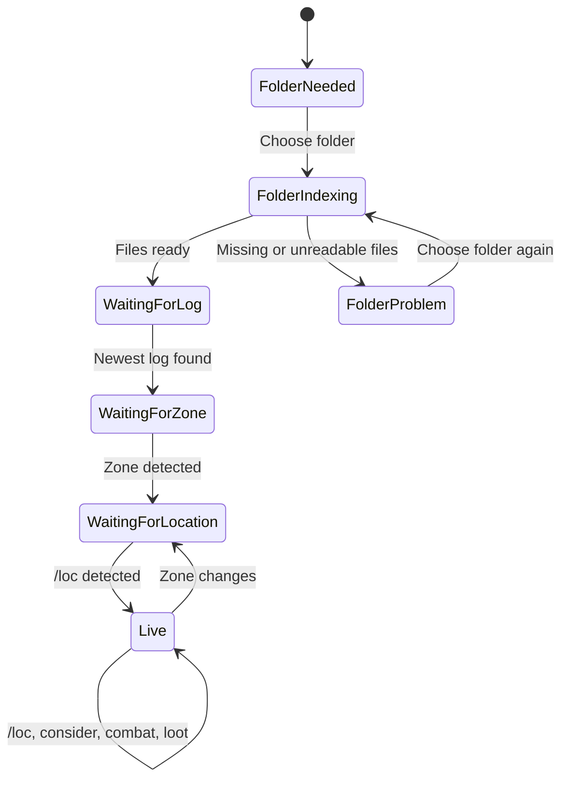

# Eye of Zomm — Product and UX Vision

Status: working product direction and road-to-v1 release contract
Baseline: 0.7.2
Last updated: 2026-09-03

Execution links: [implementation status](IMPLEMENTATION_STATUS.md) · [contributor handoff](HANDOFF.md) · [validation](../VALIDATION.md) · [Windows/game-client checklist](V0.7_MANUAL_TEST.md)

## 1. Product promise

Eye of Zomm is the quiet second screen for an EverQuest Legends session. It turns information the game already writes to ordinary text logs, the player's selected local map files, and a cached EQLWiki dataset into useful context without making the player manage a parser, browse several wiki tabs, or fight a general-purpose 3D editor.

The product should feel like it already knows what the player is doing:

- On first run, ask for one folder once.
- On later runs, select the newest character log automatically.
- When the character changes zones, make the correct zone useful automatically.
- When `/loc` appears, place and orient the player without another app click.
- When a mob is considered, show its relevant loot without taking over the screen.
- When combat begins, show the current fight; when it ends, preserve a clean encounter.
- When an item or NPC is requested, search local structured data first and open EQLWiki only when the player asks.

The core experience is reactive, local-first, and glanceable. It must not hook the client, read process memory, inject code, send game commands, or automate movement.

## 2. Outcomes and non-goals

### Desired outcomes

1. A new user reaches useful live state after one folder choice.
2. A returning user normally performs zero setup actions.
3. A player can answer “Where am I?”, “How do I get there?”, “What can this drop?”, and “How did that fight go?” with no more than one app navigation action.
4. The UI explains its current state before an action can fail.
5. Map coordinates, elevation, facing, and routing agree with the game closely enough to earn trust.
6. Common information is visible at a glance; depth appears on demand.
7. Every foreground wiki navigation is intentional, while dataset refresh remains lightweight and cached.

### Explicit non-goals

- Recreating the entire EQLWiki article experience inside the app.
- Guessing a live NPC target when the log does not expose one reliably.
- Screen reading, OCR, process inspection, memory reading, packet inspection, or client modification.
- Sending `/loc`, movement input, targeting input, or any other game command.
- Route-following automation. Eye of Zomm may calculate and display a route, never drive it.
- Exposing every diagnostic and rendering control from the upstream Zone Viewer.

## 3. Primary users and jobs

### The active explorer

Plays with the game in the foreground and Eye of Zomm pinned beside or over it. Frequently changes zones, spams `/loc`, looks for named mobs, and needs navigation guidance without losing focus.

Key job: “Keep me spatially oriented and help me reach something interesting.”

### The loot planner

Wants to know which current-zone targets have upgrades for the active class combination. Uses considers, NPC lists, item hovers, and wiki links.

Key job: “Show me worthwhile loot here before making me search globally.”

### The combat reviewer

Wants live DPS during a fight and a readable breakdown afterward. Does not want unrelated combat separated incorrectly or distinct pulls merged together.

Key job: “Tell me what happened in this fight and preserve it as one understandable encounter.”

### The returning multi-character player

Has several `eqlog_*.txt` files and expects the app to follow whichever character is currently active. Sometimes pins a particular log for testing or review.

Key job: “Choose the right character automatically, but let me override it clearly.”

### The cautious user

Needs confidence that the app is read-only, local-first, and not interacting with the game client in prohibited ways.

Key job: “Make it obvious what data is being read, from where, and why.”

## 4. UX principles

### 4.1 React before asking

If the app can infer the correct choice safely, it should do so. Folder selection is the one necessary first-run choice. The current log, zone, class profile, player location, and relevant zone items should flow from it.

### 4.2 One primary action per state

Each screen should have one obvious next action:

- No folder: **Choose EverQuest folder**.
- Folder but no log: **Open Settings** or explain where the log is expected.
- Zone but no location: **Type `/loc` in game**; do not tell the user to reselect an already selected folder.
- Loaded map: select a destination or change view.
- Empty search: show relevant defaults rather than an empty catalog.

### 4.3 Zero-click live updates

Log-driven changes should update automatically. Zone detection, `/loc`, considers, combat, kills, loot, and profile detection must not require a Sync click. Sync controls are recovery/manual controls, not the normal workflow.

### 4.4 Progressive disclosure

The default surface answers common questions. Detailed statistics, full drop sources, route diagnostics, rendering details, and data-management controls live behind a deliberate interaction.

### 4.5 Preserve user context

The app should remember the folder, log-selection mode, pin state, window mode, selected map view, item tier, era, and deliberate filters. Automatic events may update content but should not silently undo an explicit view choice.

### 4.6 State before error

Show “Folder ready · type `/loc` in game” before the user clicks Sync. Distinguish:

- folder not chosen;
- folder chosen and being indexed;
- folder ready but log absent;
- log ready but zone absent;
- zone ready but no location seen;
- zone and location synchronized;
- local map file unavailable.

### 4.7 Spatial truth is a contract

Coordinate conversion, player marker, camera focus, labels, and paths must share one canonical EQ coordinate basis. No screen may invent its own axis swap or sign inversion.

### 4.8 Color is reinforcement, not the only signal

NPC con colors tint the card or row and retain a text label. Route/error/success states use text and shape in addition to color.

### 4.9 The game keeps focus

Transient intelligence should appear without demanding a click. Pinned mode hides only custom window chrome, remains in the Windows taskbar, and never steals focus for routine log events.

### 4.10 Recovery is part of the happy path

A renamed folder, rotated log, missing map file, stale cache, or interrupted dataset update should have a specific recovery action and preserve unrelated preferences.

## 5. Information architecture

The application has seven destinations, ordered by frequency and immediacy:

1. **Overview** — session orientation and recent activity.
2. **Live Map** — position, navigation, named mobs, and minimal-mode workspace.
3. **NPCs** — current-zone target intelligence and paths.
4. **Items** — current-zone/class loot first, global research on demand.
5. **Drops** — observed loot history and evidence-based rates.
6. **Combat** — current and historical encounters.
7. **Settings** — folder/log, character fallback, window, parser, and dataset controls.

The persistent header contains only cross-cutting state and actions:

- character;
- classes;
- level;
- zone;
- log readiness;
- Search EQLWiki;
- Pin to top;
- Minimal/Full view.

Minimal mode is not a separate product area. It is a compact presentation of Live Map with map-view controls, current-fight DPS, named-mob/drop intelligence, and the consider tray.

## 6. Click budgets

These are design constraints, not aspirational marketing numbers.

| Goal | First session | Returning session | App clicks after prerequisite log event |
|---|---:|---:|---:|
| Reach useful live state | 1 folder choice | 0 | 0 |
| Open the live map | 1 | 1 | 1 |
| Place the player from `/loc` | 0 | 0 | 0 |
| Switch First/Top/Map view | 1 | 1 | 1 |
| Inspect a considered mob's loot | 0 | 0 | 0 |
| Keep consider loot open | 0 while hovered/focused | 0 | 0 |
| Route to the considered mob | 1 | 1 | 1 |
| Route to a listed current-zone mob | 2 from anywhere; 1 from NPC/Map | same | 1 |
| See useful current-zone class items | 1 to open Items | 1 | 1 |
| Search the global item catalog | 1 field focus + typing | same | 1 |
| Search EQLWiki | 1 field focus + typing/Enter | same | 1 |
| Enter or leave minimal mode | 1 | 1 | 1 |
| Return to automatic newest-log selection | 2: Settings + action | same | 1 in Settings |

No recovery flow should make the player reselect a valid folder merely to wake up the map.

## 7. Core state model

The visible copy and available primary action must be derived from this state. “Sync” must never collapse these states into a generic “set it in options” warning.

## 8. End-to-end UX flows

### 8.1 First run

1. Launch Eye of Zomm.
2. A focused first-run card asks for the EverQuest Legends folder and explains in one sentence that `Logs`, `Maps`, and game files will be read locally.
3. Click **Choose EverQuest folder**.
4. The system picker starts at `C:\EverQuest Legends` when present.
5. After selection, the app:
   - saves the root folder;
   - finds `Logs` beneath it;
   - selects the most recently modified `eqlog_*.txt`;
   - begins polling the log;
   - indexes supported local map/archive files;
   - dismisses setup without a second confirmation.
6. Overview appears immediately. The map may index in the background and reports its readiness visibly.

Acceptance criteria:

- One system-picker confirmation is the only required setup interaction.
- Cancel leaves the setup card open and does not create a broken partial configuration.
- Selecting `Logs` or an individual `eqlog_*.txt` may be normalized back to the installation root when the root can be inferred safely.
- The chosen path survives restart.

### 8.2 Returning launch

1. Launch Eye of Zomm.
2. Cached UI/data paints without waiting for GitHub.
3. The saved root is validated and map indexing starts automatically.
4. Automatic log mode resolves the newest log at that moment, not only the file that was newest during setup.
5. The header shows the chosen character/log state.
6. New log events begin updating the app with no action.

If the root moved or disappeared, show one recovery card with the previous path and **Choose folder again**. Keep all non-path preferences.

### 8.3 Live location tracking

1. Enter a zone; Eye of Zomm loads the matching local archive/map automatically.
2. Before a location has been logged, the map says: “Zone ready · type `/loc` in game once.”
3. Type `/loc` in EverQuest.
4. Within one polling interval, Eye of Zomm:
   - reads EQ's logged Y, X, Z values;
   - normalizes them to canonical X, Y, Z without flipping signs;
   - places the player on the appropriate walkable surface;
   - centers the active map view on that position;
   - updates the marker/minimap.
5. A later `/loc` computes a planar movement vector from the previous point and orients first person/minimap to that trajectory.
6. The player may switch First, Top, or Map at any time. Later `/loc` updates preserve that explicit view and re-center it rather than forcing First Person.

### 8.4 Navigate to a named mob

Entry points:

- **Path** beside a current-zone mob in minimal mode;
- **Path in map** on an NPC card;
- **Path** in the consider tray;
- the persistent **Navigate to** field within Live Map.

Flow:

1. Click **Path**.
2. Eye of Zomm opens Live Map if needed and ensures the current zone is loaded.
3. Resolve the destination in this order:
   - exact baked-in local map label;
   - normalized local map label;
   - schema-v3 EQLWiki NPC coordinate.
4. Mark the destination immediately, even while routing is calculated.
5. Build a collision-validated, directed route from the player's current location.
6. Show the route and shortest traversable distance.
7. Preserve the player's selected First/Top/Map presentation.
8. Keep the destination active. A later `/loc` re-routes after meaningful movement without making the player select the NPC again.
9. **Clear** removes the route and destination explicitly; a zone change clears a destination from the old zone.

Movement contract:

- every edge must be clear of blocking geometry;
- upward movement may gain at most 6 EQ Z units per traversable step;
- downward movement has no height limit when the lower surface is exposed;
- a downward edge is not assumed reversible;
- a route may not fall through an overlapping upper floor;
- floors, ramps, corridors, and doors must remain spatially distinct;
- “no route found” still leaves a useful destination marker and source explanation.

### 8.5 Consider-to-loot

1. Consider an NPC in game.
2. The parser recognizes standard and Legends descriptor forms such as `- a rare creature - scowls at you`.
3. A tray docks to the bottom without changing the active app destination or stealing keyboard focus.
4. It shows:
   - clean NPC name;
   - level and con label;
   - known drops;
   - embedded item icons when available;
   - **My Class** filter;
   - **Path**;
   - close control.
5. Hovering/focusing the tray pauses dismissal. Leaving resumes a shorter grace period.
6. Hovering an item opens its Itembox-style detail card.

If no drops are known, keep the NPC identity and path action visible. Explain whether the dataset has no drops or the class filter removed them.

### 8.6 Current-zone item discovery

1. Open **Items**.
2. With no query, show only items known to drop in the current zone and usable by the detected/selected class combination.
3. Rank equipment and meaningful-stat items above consumables, tradeskill pieces, and generic inventory objects.
4. Show one compact scope line stating item count, class scope, zone scope, and query if present.
5. Typing in Search broadens to all zones by default, because a deliberate query overrides the contextual default.
6. The user can explicitly re-enable **Current zone** to constrain that search.
7. Class, slot, era, sort, and tier changes update results locally.
8. **Reset** restores the contextual current-zone, detected-class, recommended-order state.
9. Hovering or keyboard-focusing an item shows its wiki-formatted Itembox data. Tier greater than zero adds a clearly labeled adjusted-stat block, shows base values beside changed values, and updates an already open tooltip immediately.

### 8.7 Combat and loot review

1. The current fight begins with the first outgoing hostile action.
2. Current-fight DPS stays prominent on Overview and minimal Live Map.
3. Combat events remain in the same encounter while successive events are no farther apart than the configured quiet period.
4. A later hostile event starts a new encounter.
5. Encounter name is the first attacked NPC plus start timestamp.
6. Logged loot is recorded with item, quantity, source, zone, and time.
7. Observed drop chance is shown only as local evidence: drops observed divided by matching kills observed, capped at 100%, with numerator/denominator visible.

The product must never present a local observed percentage as an authoritative wiki drop rate.

## 9. Feature specifications and user stories

### 9.1 Global shell

User stories:

- As a player, I want character, classes, level, and zone in one line so I can verify the app is following the correct session.
- As a player, I want global wiki search to remain typeable and predictable so I can research without navigating to another app tab first.
- As a player, I want pinning and compact mode available everywhere so window management does not depend on the current feature.
- As a keyboard user, I want visible focus and Enter behavior on search and buttons.

Requirements:

- Search is strictly EQLWiki `Special:Search` and opens the system browser.
- The search field cannot be covered by an invisible overlay or lose pointer events.
- Pinned mode hides only the custom draggable title bar and remains present in the taskbar.
- Window controls remain reachable in every mode.
- Product copy uses “Eye of Zomm”; retired naming never appears.

### 9.2 Overview

User stories:

- As a player, I want to see my current zone and fight at a glance.
- As an explorer, I want a short list of level-relevant current-zone NPCs, not an exhaustive database dump.
- As a troubleshooter, I want a small recent-event stream so I can tell whether the log parser is alive.

Requirements:

- Current zone is the visual anchor.
- Current fight is the only primary metric.
- No permanent Current Target, player card, or last-location card.
- NPC rows use con tint plus textual con/level.
- Recent activity is capped and secondary.
- Primary action is **Open live map**.

### 9.3 Live Map

User stories:

- As an explorer, I want first person centered at my logged location so the viewer mirrors my movement.
- As a planner, I want a navigable top-down 3D view without losing my current location.
- As a classic-map user, I want the local map-file overlay with all floors visible by default.
- As a compact-mode user, I want all three view controls to remain reachable.
- As a player, I want named mobs labeled and pathable without exposing editor controls.
- As a user with a configured folder, I want the viewer to reconnect on launch automatically.
- As a player following a route, I want my destination and route result to remain visible while `/loc` updates re-center me.

Requirements:

- Parent and embedded viewer expose the same three named modes.
- Selected mode persists and survives `/loc` updates and window-mode changes.
- All floors are visible unless the user explicitly filters them.
- Folder badge conveys needed, connecting, ready, or unavailable.
- Folder, log, zone, and `/loc` readiness are separate visible steps; an already valid folder is never described as missing.
- Manual Sync actions are available as recovery, but automatic log events are primary.
- Location status uses labeled X/Y/Z to make axis debugging possible.
- Named-mob labels, player marker, destination, and route share the same transform.
- Destination search, route status, distance, and **Clear** remain in the Live Map workspace in full and minimal modes.
- Advanced rendering diagnostics and duplicate navigation controls remain hidden.

### 9.4 Minimal mode

User stories:

- As a player keeping the game foregrounded, I want only navigation, current DPS, and zone loot intelligence.
- As a player switching between map styles, I want mode controls in the compact header.
- As a loot planner, I want **My Class** and **Named only** without opening Settings.
- As a player who needs more map room, I want to collapse and restore the intel panel without leaving minimal mode.

Requirements:

- Contains map, compact mode switch, current fight DPS/name, and mob/drop list.
- Consider tray overlays the bottom and remains inspectable.
- Does not hide the app from the taskbar.
- Does not remove the ability to unpin or return to Full view.
- Intel panel is visible by default and can be collapsed from the compact header.
- At the minimum supported width, map controls and window actions do not overlap.

### 9.5 NPCs

User stories:

- As a player, I want the current zone preselected so results are immediately relevant.
- As a leveler, I want con tint and level together so color is not ambiguous.
- As a loot hunter, I want several known drops on the NPC card with item hover details.
- As an explorer, I want one-click routing from a card.

Requirements:

- Current-zone-only is on by default.
- Search works within the current scope; the scope toggle is explicit.
- Cards show zone, level, con, selected known drops, Wiki, and Path.
- Unknown levels and missing locations have honest fallbacks.

### 9.6 Items

User stories:

- As a player, I want gear available in my current zone for my classes before generic global items.
- As a researcher, I want a deliberate search to override contextual defaults.
- As a multi-class player, I want detected classes shown as automatic selections and manual overrides available.
- As a Legends player, I want tier scaling visible in cards and tooltips.
- As a focused researcher, I want slot and sort controls that override the smart default without losing my class context.

Requirements:

- Default scope is current zone + effective class + era.
- Ranking favors equipped slots, meaningful stats, and named sources.
- Generic consumables do not dominate the first screen.
- An **Auto** class chip returns to detected log classes.
- Search index includes name, class, slot, source, and source zone.
- Slot and sort overrides persist; **Reset** restores contextual recommended browsing.
- Item hovers use cached data/icons and never fetch an article in the background.
- Adjusted stats are distinctly labeled, changed values include their base value, and the open detail updates while the slider moves.

### 9.7 Drop log

User stories:

- As a player, I want every recognized loot event recorded with source and time.
- As an analyst, I want the evidence behind a percentage.
- As a researcher, I want item details on hover.

Requirements:

- Support linked items, quantities, corpse wording variants, and Dragon Hoard/storage wording.
- Newest entries appear first.
- Percentage copy says “observed” and shows drops/kills.
- Unknown source remains explicit rather than guessed.
- Session/current-zone summary stays compact.

### 9.8 Combat

User stories:

- As a player, I want pulls grouped by a quiet-time threshold that I control.
- As a reviewer, I want an encounter named after the first NPC attacked and its time.
- As a player, I want outgoing player damage distinguished from unrelated group damage.

Requirements:

- Quiet period range is validated and persists.
- Encounter list and detail use a stable selection.
- Current-fight DPS expires after the same quiet-period model.
- Healing, runes, kills, and damage remain distinguishable.
- Large sessions cap rendered rows without discarding parser state unexpectedly.

### 9.9 Settings

User stories:

- As a returning user, I want the game folder to be the primary configuration.
- As a multi-character player, I want newest-log automatic mode and an explicit file override.
- As a troubleshooter, I want to see whether map files and the active log are ready.
- As a user, I want to restore detected level/classes after manual fallback values.

Requirements:

- First card is EverQuest folder, active log, log mode, and map-file state.
- **Change folder** is primary; **Choose log** is secondary; **Use newest log** appears when overridden.
- Character inputs are labeled as fallbacks, not a required setup form.
- Window, encounter gap, and wiki data are separate compact cards.
- Changing the folder resets only path-derived state and reconnects the viewer immediately.

### 9.10 Dataset and wiki boundary

User stories:

- As a player, I want the app useful offline after installation.
- As a wiki operator, I do not want clients crawling MediaWiki.
- As a user, I want explicit wiki links when the local summary is insufficient.

Requirements:

- Release bundles include a validated schema-v3 production snapshot.
- Startup checks only the small GitHub dataset manifest and never delays first paint.
- Changed gzip is hash-checked, schema-validated, and atomically installed.
- Failure retains the last valid dataset.
- Search and exact page links are foreground user actions.

## 10. Empty, loading, error, and recovery language

| State | Preferred message | Primary recovery |
|---|---|---|
| No folder | Choose your EverQuest folder to load maps and logs. | Choose folder |
| Folder indexing | Connecting to Maps and game files… | Wait; allow cancel only if genuinely cancellable |
| Folder ready, no log | Game folder ready · waiting for an `eqlog_*.txt` in Logs. | Open Settings |
| Log ready, no zone | Game folder and log ready · waiting for the next zone line. | None |
| Zone ready, no `/loc` | Zone ready · type `/loc` in game once. | Type `/loc` in game |
| Location ready | X … · Y … · Z … | None |
| Missing zone archive | No local archive matched this zone. | Show expected filename; Change folder |
| Missing map overlay | 3D is ready, but no matching map `.txt` was found. | Stay in 3D; show Maps path |
| No NPC coordinate | NPC is known, but no map label or wiki location is available. | Open Wiki |
| No traversable route | Destination marked; no collision-valid route was found. | Inspect marker/change floor/report zone |
| No class drops | No known drops match your classes. | Turn off My Class |
| Dataset update failure | Using the last valid dataset; update unavailable. | Retry Sync with Wiki |

Avoid “try again” without identifying what is missing. Avoid directing users to Settings when the configured value is already valid.

## 11. Interaction and accessibility standards

- Every actionable control is a semantic button, link, input, or select.
- Visible focus treatment meets the same prominence as hover treatment.
- Enter submits Search EQLWiki; Escape closes transient trays/tooltips where appropriate.
- Con, connection, and route states include text in addition to color.
- Minimum pointer target is 32×32 px in compact surfaces and 36×36 px elsewhere where layout permits.
- Tooltips are reachable by keyboard focus; Escape dismisses tooltip and consider-tray content without moving focus automatically.
- Transient consider content uses a polite live region and does not move keyboard focus automatically.
- Animation is short and nonessential; reduced-motion preferences should disable entrance movement.
- Text remains legible at 125% and 150% Windows scale.
- Minimal mode supports the documented minimum 720×420 window without hiding critical actions.

## 12. Visual hierarchy

### Always strongest

- current zone;
- current fight while active;
- map/player/destination when on Live Map;
- considered NPC while tray is present.

### Secondary

- character profile verification;
- named mob/drop list;
- active filters and scope;
- connection state when healthy.

### Tertiary/on demand

- exact source lists beyond the first few;
- revision/data-pack metadata;
- parser diagnostics;
- renderer performance and advanced display tuning.

Gold is reserved for interactive emphasis and EverQuest-flavored headings. Con colors should not compete with primary actions. Healthy states should be calm rather than permanently bright.

## 13. Performance and responsiveness targets

These are product targets to measure in representative Windows builds:

| Interaction | Target |
|---|---:|
| Cached shell first paint | under 2 seconds on a mid-range PC |
| New log line to visible UI | under 1 second at default polling |
| Tab/view switch | under 100 ms excluding first zone decode |
| Item/NPC filtering | under 100 ms for the production pack |
| Tooltip open/update | next animation frame |
| Folder readiness feedback | visible within 250 ms |
| Cached zone reopen | under 3 seconds |
| Initial zone decode | continuous progress; never frozen UI |
| Typical in-zone route | first marker immediately, route target under 3 seconds |

Long operations must publish stage-specific progress and remain cancellable where cancellation is safe.

## 14. Product analytics without telemetry

The project should not add remote behavioral telemetry by default. Quality can be measured through:

- deterministic parser fixtures from redacted log lines;
- opt-in diagnostic export containing app version, state labels, map/archive identities, transforms, and route result without account credentials;
- automated production-pack relevance checks;
- release checklists and structured tester reports;
- local timing counters visible only in a diagnostic export.

A future diagnostic bundle must redact character names and filesystem paths by default.

## 15. Acceptance scenarios for release candidates

### Setup and persistence

- Fresh profile: choose `C:\EverQuest Legends` once; newest file in `Logs` becomes active.
- Restart: no picker appears; the then-newest automatic log is selected.
- Manual log override: restart preserves that file.
- **Use newest log** returns to automatic mode.
- Moved root: one recovery prompt, preferences preserved.

### Coordinate and camera truth

- Logged `Your Location is -30, -961, -66` produces map X `-961`, Y `-30`, Z `-66`.
- In a stacked zone, that Z remains on the nearest valid floor around `-66`; it must not snap to the floor around `-37` merely because collision was queried from above.
- Two different `/loc` values orient first person along the observed trajectory.
- First, Top, and Map remain centered on the same location.
- Switching window modes does not remove map-mode controls or change the chosen map mode.
- All floors appear by default after loading a zone.

### Consider and loot

- `Soldier of V Zher - a rare creature - scowls at you, ready to attack -- looks like quite a gamble. (Lvl: 26)` opens the docked tray for `Soldier of V Zher` at level 26.
- Hover pauses dismissal.
- My Class changes visible drops without closing the tray.
- Item hover shows cached icon/data and tier-adjusted stats when tier is nonzero.

### Navigation

- An exact local map label is preferred over wiki coordinates.
- A wiki coordinate marks the fallback destination.
- +6 Z traversal is allowed; greater upward traversal is rejected.
- Any exposed downward height is allowed.
- An overlapping upper floor prevents a route from falling through it.
- Every displayed route segment is collision-valid.
- A selected destination survives later `/loc` samples and re-routes after at least eight units of movement.
- Route state says whether a path was built, only a marker was available, or no destination coordinate was found.

### Catalog relevance

- Items opens with current-zone/class results, not alphabetic global potion results.
- Equipment/stat items rank before generic consumables.
- Search broadens globally by default.
- Explicit Current zone toggle remains respected.
- Auto classes reflect the detected class combination.
- Slot and alphabetical sort are explicit overrides; Reset returns to recommended current-zone browsing.
- Moving Item tier updates the visible cards and an already-open Itembox hover immediately.

### Window behavior

- Pin keeps the app above the game.
- Pin hides custom titlebar only.
- App remains on the taskbar.
- Minimal mode retains First/Top/Map, Pin, and Full view controls.

## 16. Road to v1

The route to 1.0 is organized around user confidence, not the number of features shipped. Each release must close one complete loop and retain all earlier acceptance contracts.

| Release | Product question it must answer | Primary scope | Exit gate |
|---|---|---|---|
| 0.5 — foundation | “Can the app read the right things safely?” | Folder/log selection, coordinate contract, three map modes, consider tray, encounters, drops, production data | Automated contracts pass and the app installs with a real dataset |
| 0.6 — usable loop | “Can I understand state and get somewhere without fighting the UI?” | Explicit readiness, persistent destination routing, item relevance, texture correction, keyboard details, non-modal recovery | Complete explorer and loot-planner journeys work with no dead-end or generic Sync error |
| 0.7 — replacement map | “Can this replace the in-game map during normal play?” | Rare-mob labels, compact loot browsing, continuous `/loc` heading, mode-safe recentering, route continuity | A player can orient, choose a worthwhile target, inspect loot, and follow a route in every map mode |
| 0.8 — spatial confidence | “Can I trust this path in difficult zones?” | Formal navmesh, directed movement links, next-turn guidance, diagnostics, route corpus | Route matrix passes on outdoor, indoor, stacked-floor, ramp, door, and drop cases |
| 0.9 — decision intelligence beta | “What is worth doing, and will this recover on another PC?” | Durable sessions, encounter/loot evidence, upgrade ranking, export, migration, updater, accessibility, beta feedback | A user can plan/play/review and no release blockers remain across the Windows test matrix |
| 1.0 — trusted release | “Can we support this as a stable public product?” | Signed distribution, support docs, compatibility policy, final polish | Signed reproducible installer, green release gates, documented known limits, support path |

### 16.1 Version 0.6 — usable loop

Release thesis: the app should reveal what it knows, preserve what the player chose, and turn the most frequent goals into either zero-click reactions or one-click actions.

Committed user stories:

- As a first-time user, I choose the game folder once and immediately see whether folder, log, zone, and `/loc` are individually ready.
- As a returning user, I resume my last full view and map mode while automatic log selection follows the newest log.
- As an explorer, I type or choose a current-zone destination once, see whether it produced a path or marker, and keep that destination while later `/loc` lines re-route me.
- As a minimal-mode user, I retain map-mode and destination controls and can collapse the intel rail when I need more map width.
- As a loot planner, I open Items to current-zone/class gear and deliberately override slot, order, zone, class, era, or search.
- As an item researcher, I can focus the same Itembox card with mouse or keyboard and see tier-adjusted values update while the slider moves.
- As a player with the game foregrounded, routine recovery feedback appears inside Eye of Zomm instead of a modal browser alert.

0.6 implementation contract:

- A four-step map readiness rail: Folder → Log → Zone → `/loc`.
- A persistent Live Map destination field with current-zone suggestions, Enter support, Find path, Clear, route source/result, distance, and re-route-on-movement.
- Route recalculation threshold of eight 3D units to prevent rebuilding for duplicate `/loc` lines.
- Selected destination waits for the first `/loc` instead of failing or asking for the folder again.
- Header map-mode controls remain available whenever Live Map is active, including minimal mode.
- Last full-mode view and selected map presentation persist across window-mode changes.
- Minimal intel rail defaults open and has a remembered collapse toggle.
- Items default to current zone, effective classes, current era, and recommended order. Search broadens globally unless zone was explicitly pinned.
- Slot and sort overrides plus one-click Reset.
- Item icons in result cards and keyboard-focusable Itembox details.
- Tier-adjusted Itembox values visually identify changes and retain base values in parentheses.
- S3D bitmap lookup uses the WLD bitmap fragment's actual `fileName`, normalizes `.bmp`/`.dds`, supports animated frame filenames, and invalidates stale parsed-zone cache entries.
- In-app status notices replace focus-stealing `alert()` recovery.
- Automated release checks assert all of the above and retain coordinate, floor, con, consider, loot, encounter, and production-catalog contracts.

Known 0.6 limits, stated rather than hidden:

- Routing is still a collision-validated walkable-surface graph plus local-map fallback, not a polygonal Recast navmesh.
- A route can only be as good as the decoded collision geometry and destination coordinate.
- The app cannot know the player moved until a new `/loc` line is written.
- Real game archives cannot be included in the repository, so final texture/geometry acceptance requires a tester's selected installation.
- The unsigned installer may trigger Windows reputation warnings until a trusted Authenticode certificate is configured.

0.6 exit checklist:

1. Fresh-folder and returning-startup flows complete with the expected automatic log.
2. Befallen coordinate fixture remains X `-961`, Y `-30`, Z `-66` and stays on the correct stacked floor.
3. Two `/loc` samples update facing; a live destination re-routes without another selection.
4. First/Top/Map remain available through full/minimal transitions.
5. The exact Legends rare-creature consider line opens the bottom tray.
6. Befallen + MNK production data opens with equipment ahead of potions.
7. Item tier changes an open detail and changed values are visibly different from base.
8. WLD material lookup resolves static and animated bitmap filenames after a v16 zone-cache rebuild.
9. Clean-checkout tests, production-catalog gate, Windows build, and installer artifact all succeed.

### 16.2 Version 0.7 — replacement map

Release thesis: during ordinary exploration, the player should not need the in-game map to know where they are, what named targets matter, what those targets drop, or which direction to travel.

Committed user stories:

- As an explorer, I see named and rare mobs anchored in First Person, Top Down, and Map Overlay and can make one my destination with one click.
- As a class combination, I see targets with relevant loot before targets with no known upgrade, without losing the ability to inspect all known drops.
- As a minimal-mode player, I can search a mob or item, expand loot, read Itembox details, select a route, and switch map presentation without returning to the full app.
- As a player who binds `/loc` to movement, repeated lines follow my latest position without queuing stale camera moves or spinning on coordinate jitter.
- As a player who explicitly chose Top or Map, live location updates preserve that choice instead of flashing through First Person.
- As a route follower, the golden line remains usable in every presentation and continuous movement cannot indefinitely postpone re-routing.

0.7 implementation contract:

1. EQLWiki current-zone NPC coordinates are projected into the same canonical map basis as local map geometry and `/loc`.
2. Rare labels remain screen-anchored while moving/zooming, honor selected floors, cap density, and favor current-class loot relevance.
3. A label click selects a persistent route. The compact rail supplies expandable class-filtered/all-loot browsing and Itembox details.
4. The log reader uses an active-map cadence and retains only the newest unrendered location when movement bindings produce bursts.
5. Heading derives from a short recency-weighted movement window. Sub-unit jitter is ignored, duplicate samples preserve facing, and zone-scale jumps do not invent a direction.
6. Location placement updates the retained First Person pose and player arrow without using a visible intermediate mode.
7. Route refresh uses an eight-unit movement threshold but cannot have its timer continuously reset by new samples; expensive path work never blocks the newest player marker.
8. The product remains read-only: the player creates the `/loc` bindings in EverQuest and Eye of Zomm only consumes the resulting log lines.

0.7 exit gate: the Windows script passes continuous movement in First/Top/Map, rare labels stay aligned and routable, minimal mode supports complete loot browsing, and no continuous `/loc` stream can starve position or route updates.

### 16.3 Version 0.8 — spatial confidence

Release thesis: paths must be predictable enough that a player will use them in a multi-floor dungeon without cross-checking every turn.

Implementation note (0.7.3): deterministic remaining-distance, next-turn/facing/off-route cues, redacted diagnostics, and the eight-expectation geometry corpus are implemented. The pinned `recast-navigation` 0.43.1 module worker now passes 8/8 shared outcomes, rejects partial/ungrounded/reversed-drop results, and exposes latest-request-wins timeout/fallback states. It remains dormant until decoded real-zone integration and the Windows matrix pass; the current collision-validated graph is still authoritative. See [the navmesh evaluation](NAVMESH_EVALUATION.md) and [implementation status](IMPLEMENTATION_STATUS.md).

Navigation architecture:

1. Decode the collision mesh using the existing read-only local-file pipeline.
2. Build a Recast polygon mesh in a worker, never on the renderer/UI thread.
3. Use a single documented coordinate adapter at the boundary. EQEmu demonstrates the equivalent server-side Detour bridge by passing EQ `(x, y, z)` to Detour as `(x, z, y)` and converting it back at the route boundary.
4. Add directed off-mesh links for exposed downward drops and upward transitions no greater than +6 EQ Z.
5. Query with Detour, smooth the corridor, validate every rendered segment against local collision, and fall back to the 0.7 graph if generation fails.
6. Keep the implemented next-turn cue, remaining distance, redacted route diagnostics, and topology corpus covered while adding shared geometry-backed outdoor/indoor/stacked/ramp/door/drop execution for current and candidate engines.

Route-engine UX contract: preparation and queries remain background work. The current valid line stays visible until a validated replacement is ready; stale results are discarded; view/minimal choices never change; compatibility fallback is automatic; and normal UI uses “path,” “updating,” and concrete recovery language rather than navmesh/Recast terminology.

The design takes conceptual guidance from EQEmu's [Detour navmesh pathfinder](https://github.com/EQEmu/EQEmu/blob/master/zone/pathfinder_nav_mesh.cpp) and [ground/ceiling raycasts](https://github.com/EQEmu/EQEmu/blob/master/zone/map.cpp), but Eye of Zomm remains a separate read-only viewer and will not copy server movement or automation behavior.

0.8 exit gate: at least 95% of the curated route corpus produces the expected path/no-path result, no displayed segment violates collision or directed elevation policy, and route work does not block input/rendering.

### 16.4 Version 0.9 — decision intelligence and public beta

Release thesis: current context and locally observed history should help answer “what should I do next?” without claiming knowledge the evidence cannot support.

Planned user stories:

- As a multi-character player, I can separate or combine session history intentionally.
- As a combat reviewer, I can compare two encounters and expand actor/ability contributions.
- As a loot hunter, I can group observed drops by NPC and zone and always see the numerator/denominator behind a rate.
- As a researcher, I can export selected encounter/drop rows to CSV or JSON.
- As a class combination, I can rank likely upgrades by slot and relevant stats without the app pretending to know my complete build.
- As a planner, I can watch an item or NPC and see it called out when it becomes relevant in the current zone.

Data rules:

- History is local and opt-in beyond the current in-memory session.
- Retention is configurable and deletion is explicit and recoverable where practical.
- Character and filesystem identifiers are redacted from diagnostics by default.
- “Observed” percentages never become wiki-authoritative percentages.
- Recommendation explanations name the rules used: class, slot, stats, source, zone, era, and selected tier.

0.9 exit gate: a player can choose a target from current-zone loot, complete encounters, inspect observed drops, compare results, and export evidence with no ambiguous provenance, with no open release blocker across supported Windows and scale-factor tests.

#### Public beta hardening within 0.9

Release thesis: unfamiliar machines and imperfect local installs must fail in understandable, recoverable ways.

Scope:

- Crash-safe preference/data migrations from every public 0.x version.
- Update availability and release-note flow that never blocks launch.
- One-click redacted diagnostics and a prefilled issue-report template.
- Windows 10/11 validation at 100%, 125%, 150%, and 200% scaling.
- Complete keyboard traversal, focus visibility, screen-reader names, reduced motion, and contrast review.
- Performance measurements for startup, production-size search, log latency, zone decode, cache reopen, route generation, and memory pressure.
- Corrupt/rotated log, missing folder, partial dataset download, stale cache, unsupported archive, and offline recovery tests.
- First-run and first-route usability sessions with people who did not build the product.

0.9 exit gate: zero known severity-1 defects, no unresolved data-loss or safety-boundary issue, all primary journeys complete at supported scale factors, and at least five unfamiliar-user sessions meet the click/error budgets.

### 16.5 Version 1.0 — trusted public release

1.0 is a quality designation, not another feature batch. It requires:

- a trusted Authenticode certificate and signature verification for the app and installer;
- deterministic version/tag/artifact agreement and reproducible release notes;
- automatic update or an equally clear supported upgrade path;
- a compatibility statement for supported Legends client/archive variants;
- concise install, safety, troubleshooting, diagnostic, and known-limit documentation;
- production dataset freshness/rollback procedures;
- a maintained issue triage and release cadence;
- no open severity-1 or severity-2 defect in setup, log following, coordinates, map rendering, navigation, or data integrity;
- all release acceptance scenarios and performance budgets green on a clean Windows machine.

Deferred beyond 1.0 unless evidence changes the priority:

- any client hook, overlay injection, automated movement, or game command;
- a full embedded web browser/wiki renderer;
- multi-user/cloud synchronization;
- speculative build scoring without complete, explainable inputs.

## 17. Product decisions and approval points

### Implemented through 0.7

1. **Remember presentation.** Preserve First/Top/Map and the last full-mode view; minimal always presents Live Map without overwriting that remembered view.
2. **Search overrides contextual item scope.** Empty query is current-zone/class; deliberate search is global unless Current zone was explicitly selected.
3. **Make Auto visible.** Detected classes appear selected while Auto remains the explicit source of truth.
4. **Keep the consider timeout calm.** Sixteen seconds initially, paused while hovered/focused, eight-second grace after leaving.
5. **Keep the route destination.** Re-route after eight or more units of observed movement; duplicate `/loc` values do not rebuild.
6. **Allow compact-map focus.** Intel rail starts visible and can be collapsed/restored from the minimal header.
7. **Make item detail keyboard-reachable.** Hover and focus share one cached Itembox surface; Escape dismisses transient content.
8. **Use non-modal feedback.** Routine state/recovery notices do not steal focus from the game.
9. **Treat movement bindings as a stream.** Coalesce `/loc` bursts to the newest sample and preserve stable facing through duplicates and jitter.
10. **Put destinations on the map.** Project current-zone rare/named data into all three presentations and let a marker start navigation.
11. **Keep compact mode complete.** Search targets and loot, expand class-aware drops, and retain route/map controls beside the game.
12. **Never commandeer presentation for routing.** Starting a local-label or wiki-coordinate path retains First/Top/Map, camera state, floors, and full/minimal mode while work happens in the background.

### Approval points for 0.8–1.0

1. **Navmesh runtime — recommended:** use a maintained Recast/Detour WebAssembly implementation in a worker, subject to license/security review; do not ingest undocumented third-party prebuilt navmeshes as authoritative.
2. **Route re-build threshold — validate:** start at eight units, then tune with recorded redacted `/loc` traces; avoid a user-facing sensitivity setting unless real tests show a need.
3. **History retention — proposed:** current session by default; explicit opt-in for 30-day local history, with Clear history beside the setting.
4. **Upgrade ranking — proposed:** explainable stat/slot relevance, never a single unexplained “best item” score.
5. **Beta diagnostics — recommended:** one redacted JSON bundle plus optional screenshot added by the user; never package logs or filesystem paths by default.
6. **Signing — required for 1.0:** continue clearly labeled unsigned 0.x builds while procurement is deferred; do not imply Windows warnings can be eliminated without trust/signing.

## 18. Definition of done for any UX change

A change is done only when:

1. Its happy path needs no unnecessary click or repeated configuration.
2. Loading, empty, error, and recovery states are defined.
3. Explicit user choices survive unrelated automatic events.
4. The local-first/safety boundary is preserved.
5. Keyboard and non-color signals are considered.
6. Production-size data has been exercised.
7. Parser/transform/business rules have regression coverage.
8. Version, changelog, and release artifact agree.
9. The Windows build has a concrete manual verification script.
10. Any known limitation is named in user-facing language rather than hidden behind a generic failure.

## 19. Journey contracts

This table is the compact product contract for the app's most common jobs. A journey is incomplete if its recovery state sends the user through setup that has already succeeded.

| Journey | Entry condition | Default response | One primary action | Automatic continuation | Recovery without context loss |
|---|---|---|---|---|---|
| First launch | No saved game root | Focused folder chooser explains what is read | Choose EverQuest folder | Follow newest log, index maps, dismiss setup | Cancel keeps setup intact; no partial path is saved |
| Returning launch | Saved root exists | Restore shell, last full view, window state, and map mode | None | Resolve the newest log and reconnect map files | Preserve preferences and ask only for a moved root |
| Place player | Zone known, no location | Readiness stops at `/loc` and explains the in-game action | Type `/loc` in game | Place, ground, center, and later orient the player | Center control repeats the exact missing prerequisite |
| Change map presentation | Zone loaded | Retain the last selected First, Top, or Map mode | Choose mode | Later `/loc` re-centers that same mode | An unavailable overlay leaves working 3D visible |
| Navigate | Current zone plus destination | Mark destination and show calculating/waiting state | Find path or Path | Re-route after meaningful `/loc` movement | Retain destination; identify missing coordinate versus no valid path |
| Consider loot | Consider log line | Bottom tray opens with identity, con, and class drops | None | Timeout pauses for hover/focus | My Class and Wiki remain available when no filtered drops exist |
| Browse items | Items opened | Current-zone, detected-class, recommended results | None beyond opening Items | Zone/profile changes refresh scope | Search, slot, sort, class, era, and Reset are explicit overrides |
| Inspect an item | Hover or keyboard focus | Cached Itembox detail and icon | Hover/focus | Tier changes refresh adjusted values immediately | Missing fields are omitted or labeled unknown; Wiki remains explicit |
| Review a fight | Outgoing hostile event | Current fight becomes the primary metric | None | Quiet-period grouping produces an encounter | Gap setting rebuilds encounter grouping without losing raw events |
| Review a drop | Loot line | Newest row records item, source, zone, time, and evidence | Open Drops | Nearby kills update observed numerator/denominator | Unknown source stays unknown; no authoritative-rate claim is invented |
| Search the wiki | Any screen | Search EQLWiki remains globally available | Type and press Enter | System browser opens Special:Search | Empty submission does nothing; local app state is unchanged |
| Compact the window | Any screen | Pin and Minimal remain global | Toggle Pin or Minimal | Map controls, route, fight, and consider state remain usable | Full view restores the prior full destination; taskbar presence is retained |

## 20. Prioritization and risk register

Severity is based on broken player trust, not implementation size. P0 issues stop a release; P1 issues require a documented owner and near-term milestone; P2 issues may enter the scored backlog.

| Risk | Priority | Why it matters | Release evidence | Owner milestone |
|---|---|---|---|---|
| X/Y order or sign regression | P0 | A confidently wrong map is worse than no map | Parser fixture plus Befallen game-client check | Every release |
| Wrong stacked-floor grounding | P0 | Marker/path can appear in an inaccessible room | Synthetic policy tests plus Befallen Z `-66` check | Every release |
| Folder/log state contradicts reality | P0 | The first useful action becomes a dead end | Filesystem tests and clean-profile Windows run | Every release |
| Consider tray does not appear | P0 | Removes the zero-click loot loop | Exact Legends line fixture and foreground-game check | Every release |
| Search field cannot receive input | P0 | Breaks the only global research action | Static drag-region check and keyboard/mouse smoke test | Every release |
| Texture lookup falls back to gray/white | P0 | Makes 3D navigation unreadable | WLD `fileName` contract, cache bump, visual zone check | 0.6 |
| Route crosses wall or floor | P0 | Guidance becomes actively misleading | Collision/elevation tests; never label an unvalidated line valid | 0.6 graph, 0.7 navmesh |
| Destination disappears after `/loc` | P1 | Repeated selection makes navigation unusable | Persistent route state and movement re-route test | 0.6 |
| Catalog starts with generic consumables | P1 | Items looks broken despite valid data | Production pack relevance gate | Every release |
| Tier control and detail disagree | P1 | Item comparison cannot be trusted | Unit scaling plus open-tooltip interaction test | 0.6 |
| Large-zone decode blocks input | P1 | App appears crashed during a primary flow | Worker timing and cancellation budget | 0.7/0.9 |
| Local observed rate looks authoritative | P1 | Misrepresents evidence and wiki truth | Numerator/denominator copy review | 0.8 |
| Windows reputation warning | P1 before 1.0, P0 at 1.0 | Adds install friction and erodes trust | Authenticode verification in release workflow | 1.0 |
| Preference/data migration loses state | P0 at public beta | Upgrading punishes returning users | Migration matrix from every public 0.x version | 0.9 |

## 21. Uncoached usability validation

Before 0.9, run at least five sessions with players who did not build Eye of Zomm. Give the goals below without telling participants which control to use.

| Task | Starting state | Success | Target |
|---|---|---|---:|
| Get the app following the game | Fresh profile, game installed | Correct folder and newest log are active | One folder choice; under 60 seconds |
| Find where the character is | Zone entered, no prior `/loc` | Participant understands the prompt, types `/loc`, and verifies the marker | Zero app recovery clicks |
| Navigate to a named NPC | Player placed in a zone with a known named | Destination, route/marker state, and distance are understood | At most one app action from Map/NPC/consider context |
| Find a useful item here | Known zone and class profile | Participant finds current-zone class gear and can broaden deliberately | No query required for the first useful result |
| Inspect considered loot | Game foregrounded | Tray is noticed, held open, filtered, and an item is inspected | No focus theft; no prerequisite explanation |
| Review the last pull and loot | At least two pulls separated by the configured gap | Correct encounter and observed drop evidence are found | At most two destination changes |
| Recover a moved install folder | Saved root made unavailable | Participant identifies the failed step and restores it | One new folder choice; other preferences survive |

Record task completion, app clicks, wrong turns, time to first useful result, and the participant's description of what the app currently knows. Do not add behavioral telemetry to collect this silently. A release fails the usability gate when two or more participants make the same wrong turn, cannot distinguish a missing coordinate from a failed route, or treat an observed drop percentage as an authoritative wiki rate.
