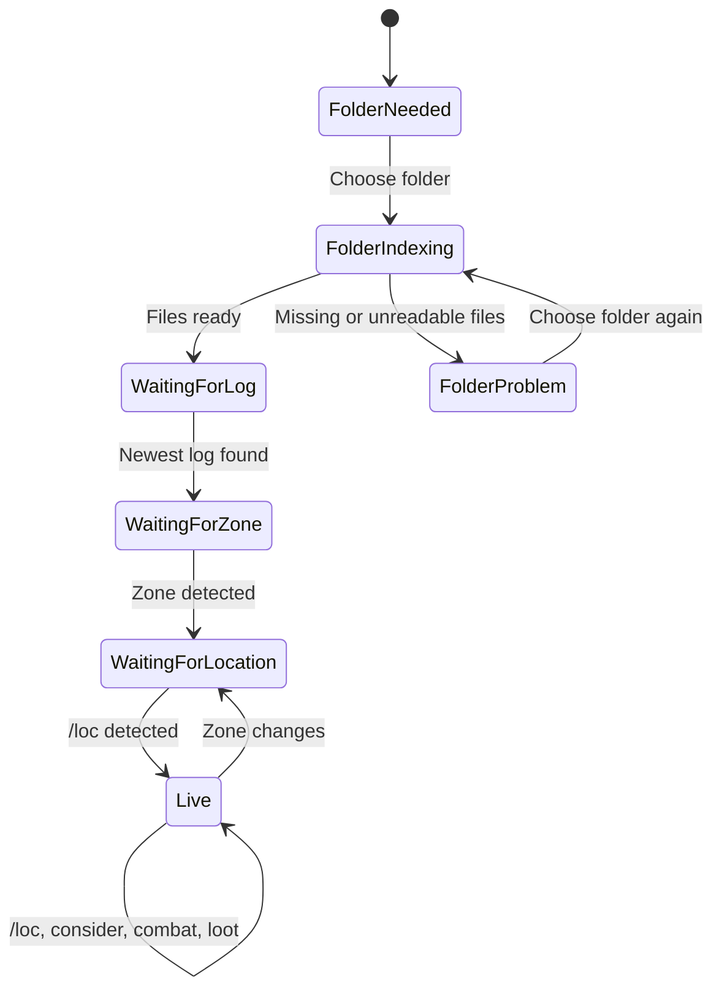

# Eye of Zomm — Product and UX Vision

Status: working product direction for review  
Baseline: 0.5.4
Last updated: 2026-09-03

## 1. Product promise

Eye of Zomm is the quiet second screen for an EverQuest Legends session. It turns information the game already writes to ordinary text logs, the player's selected local map files, and a cached EQLWiki dataset into useful context without making the player manage a parser, browse several wiki tabs, or fight a general-purpose 3D editor.

The product should feel like it already knows what the player is doing:

- On first run, ask for one folder once.
- On later runs, select the newest character log automatically.
- When the character changes zones, make the correct zone useful automatically.
- When `/loc` appears, place and orient the player without another app click.
- When a mob is considered, show its relevant loot without taking over the screen.
- When combat begins, show the current fight; when it ends, preserve a clean encounter.
- When an item or NPC is requested, search local structured data first and open EQLWiki only when the player asks.

The core experience is reactive, local-first, and glanceable. It must not hook the client, read process memory, inject code, send game commands, or automate movement.

## 2. Outcomes and non-goals

### Desired outcomes

1. A new user reaches useful live state after one folder choice.
2. A returning user normally performs zero setup actions.
3. A player can answer “Where am I?”, “How do I get there?”, “What can this drop?”, and “How did that fight go?” with no more than one app navigation action.
4. The UI explains its current state before an action can fail.
5. Map coordinates, elevation, facing, and routing agree with the game closely enough to earn trust.
6. Common information is visible at a glance; depth appears on demand.
7. Every foreground wiki navigation is intentional, while dataset refresh remains lightweight and cached.

### Explicit non-goals

- Recreating the entire EQLWiki article experience inside the app.
- Guessing a live NPC target when the log does not expose one reliably.
- Screen reading, OCR, process inspection, memory reading, packet inspection, or client modification.
- Sending `/loc`, movement input, targeting input, or any other game command.
- Route-following automation. Eye of Zomm may calculate and display a route, never drive it.
- Exposing every diagnostic and rendering control from the upstream Zone Viewer.

## 3. Primary users and jobs

### The active explorer

Plays with the game in the foreground and Eye of Zomm pinned beside or over it. Frequently changes zones, spams `/loc`, looks for named mobs, and needs navigation guidance without losing focus.

Key job: “Keep me spatially oriented and help me reach something interesting.”

### The loot planner

Wants to know which current-zone targets have upgrades for the active class combination. Uses considers, NPC lists, item hovers, and wiki links.

Key job: “Show me worthwhile loot here before making me search globally.”

### The combat reviewer

Wants live DPS during a fight and a readable breakdown afterward. Does not want unrelated combat separated incorrectly or distinct pulls merged together.

Key job: “Tell me what happened in this fight and preserve it as one understandable encounter.”

### The returning multi-character player

Has several `eqlog_*.txt` files and expects the app to follow whichever character is currently active. Sometimes pins a particular log for testing or review.

Key job: “Choose the right character automatically, but let me override it clearly.”

### The cautious user

Needs confidence that the app is read-only, local-first, and not interacting with the game client in prohibited ways.

Key job: “Make it obvious what data is being read, from where, and why.”

## 4. UX principles

### 4.1 React before asking

If the app can infer the correct choice safely, it should do so. Folder selection is the one necessary first-run choice. The current log, zone, class profile, player location, and relevant zone items should flow from it.

### 4.2 One primary action per state

Each screen should have one obvious next action:

- No folder: **Choose EverQuest folder**.
- Folder but no log: **Open Settings** or explain where the log is expected.
- Zone but no location: **Type `/loc` in game**; do not tell the user to reselect an already selected folder.
- Loaded map: select a destination or change view.
- Empty search: show relevant defaults rather than an empty catalog.

### 4.3 Zero-click live updates

Log-driven changes should update automatically. Zone detection, `/loc`, considers, combat, kills, loot, and profile detection must not require a Sync click. Sync controls are recovery/manual controls, not the normal workflow.

### 4.4 Progressive disclosure

The default surface answers common questions. Detailed statistics, full drop sources, route diagnostics, rendering details, and data-management controls live behind a deliberate interaction.

### 4.5 Preserve user context

The app should remember the folder, log-selection mode, pin state, window mode, selected map view, item tier, era, and deliberate filters. Automatic events may update content but should not silently undo an explicit view choice.

### 4.6 State before error

Show “Folder ready · type `/loc` in game” before the user clicks Sync. Distinguish:

- folder not chosen;
- folder chosen and being indexed;
- folder ready but log absent;
- log ready but zone absent;
- zone ready but no location seen;
- zone and location synchronized;
- local map file unavailable.

### 4.7 Spatial truth is a contract

Coordinate conversion, player marker, camera focus, labels, and paths must share one canonical EQ coordinate basis. No screen may invent its own axis swap or sign inversion.

### 4.8 Color is reinforcement, not the only signal

NPC con colors tint the card or row and retain a text label. Route/error/success states use text and shape in addition to color.

### 4.9 The game keeps focus

Transient intelligence should appear without demanding a click. Pinned mode hides only custom window chrome, remains in the Windows taskbar, and never steals focus for routine log events.

### 4.10 Recovery is part of the happy path

A renamed folder, rotated log, missing map file, stale cache, or interrupted dataset update should have a specific recovery action and preserve unrelated preferences.

## 5. Information architecture

The application has seven destinations, ordered by frequency and immediacy:

1. **Overview** — session orientation and recent activity.
2. **Live Map** — position, navigation, named mobs, and minimal-mode workspace.
3. **NPCs** — current-zone target intelligence and paths.
4. **Items** — current-zone/class loot first, global research on demand.
5. **Drops** — observed loot history and evidence-based rates.
6. **Combat** — current and historical encounters.
7. **Settings** — folder/log, character fallback, window, parser, and dataset controls.

The persistent header contains only cross-cutting state and actions:

- character;
- classes;
- level;
- zone;
- log readiness;
- Search EQLWiki;
- Pin to top;
- Minimal/Full view.

Minimal mode is not a separate product area. It is a compact presentation of Live Map with map-view controls, current-fight DPS, named-mob/drop intelligence, and the consider tray.

## 6. Click budgets

These are design constraints, not aspirational marketing numbers.

| Goal | First session | Returning session | App clicks after prerequisite log event |
|---|---:|---:|---:|
| Reach useful live state | 1 folder choice | 0 | 0 |
| Open the live map | 1 | 1 | 1 |
| Place the player from `/loc` | 0 | 0 | 0 |
| Switch First/Top/Map view | 1 | 1 | 1 |
| Inspect a considered mob's loot | 0 | 0 | 0 |
| Keep consider loot open | 0 while hovered/focused | 0 | 0 |
| Route to the considered mob | 1 | 1 | 1 |
| Route to a listed current-zone mob | 2 from anywhere; 1 from NPC/Map | same | 1 |
| See useful current-zone class items | 1 to open Items | 1 | 1 |
| Search the global item catalog | 1 field focus + typing | same | 1 |
| Search EQLWiki | 1 field focus + typing/Enter | same | 1 |
| Enter or leave minimal mode | 1 | 1 | 1 |
| Return to automatic newest-log selection | 2: Settings + action | same | 1 in Settings |

No recovery flow should make the player reselect a valid folder merely to wake up the map.

## 7. Core state model

The visible copy and available primary action must be derived from this state. “Sync” must never collapse these states into a generic “set it in options” warning.

## 8. End-to-end UX flows

### 8.1 First run

1. Launch Eye of Zomm.
2. A focused first-run card asks for the EverQuest Legends folder and explains in one sentence that `Logs`, `Maps`, and game files will be read locally.
3. Click **Choose EverQuest folder**.
4. The system picker starts at `C:\EverQuest Legends` when present.
5. After selection, the app:
   - saves the root folder;
   - finds `Logs` beneath it;
   - selects the most recently modified `eqlog_*.txt`;
   - begins polling the log;
   - indexes supported local map/archive files;
   - dismisses setup without a second confirmation.
6. Overview appears immediately. The map may index in the background and reports its readiness visibly.

Acceptance criteria:

- One system-picker confirmation is the only required setup interaction.
- Cancel leaves the setup card open and does not create a broken partial configuration.
- Selecting `Logs` or an individual `eqlog_*.txt` may be normalized back to the installation root when the root can be inferred safely.
- The chosen path survives restart.

### 8.2 Returning launch

1. Launch Eye of Zomm.
2. Cached UI/data paints without waiting for GitHub.
3. The saved root is validated and map indexing starts automatically.
4. Automatic log mode resolves the newest log at that moment, not only the file that was newest during setup.
5. The header shows the chosen character/log state.
6. New log events begin updating the app with no action.

If the root moved or disappeared, show one recovery card with the previous path and **Choose folder again**. Keep all non-path preferences.

### 8.3 Live location tracking

1. Enter a zone; Eye of Zomm loads the matching local archive/map automatically.
2. Before a location has been logged, the map says: “Zone ready · type `/loc` in game once.”
3. Type `/loc` in EverQuest.
4. Within one polling interval, Eye of Zomm:
   - reads EQ's logged Y, X, Z values;
   - normalizes them to canonical X, Y, Z without flipping signs;
   - places the player on the appropriate walkable surface;
   - centers the active map view on that position;
   - updates the marker/minimap.
5. A later `/loc` computes a planar movement vector from the previous point and orients first person/minimap to that trajectory.
6. The player may switch First, Top, or Map at any time. Later `/loc` updates preserve that explicit view and re-center it rather than forcing First Person.

### 8.4 Navigate to a named mob

Entry points:

- **Path** beside a current-zone mob in minimal mode;
- **Path in map** on an NPC card;
- **Path** in the consider tray;
- a future destination search within Live Map.

Flow:

1. Click **Path**.
2. Eye of Zomm opens Live Map if needed and ensures the current zone is loaded.
3. Resolve the destination in this order:
   - exact baked-in local map label;
   - normalized local map label;
   - schema-v3 EQLWiki NPC coordinate.
4. Mark the destination immediately, even while routing is calculated.
5. Build a collision-validated, directed route from the player's current location.
6. Show the route and shortest traversable distance.
7. Preserve the player's selected First/Top/Map presentation.

Movement contract:

- every edge must be clear of blocking geometry;
- upward movement may gain at most 6 EQ Z units per traversable step;
- downward movement has no height limit when the lower surface is exposed;
- a downward edge is not assumed reversible;
- a route may not fall through an overlapping upper floor;
- floors, ramps, corridors, and doors must remain spatially distinct;
- “no route found” still leaves a useful destination marker and source explanation.

### 8.5 Consider-to-loot

1. Consider an NPC in game.
2. The parser recognizes standard and Legends descriptor forms such as `- a rare creature - scowls at you`.
3. A tray docks to the bottom without changing the active app destination or stealing keyboard focus.
4. It shows:
   - clean NPC name;
   - level and con label;
   - known drops;
   - embedded item icons when available;
   - **My Class** filter;
   - **Path**;
   - close control.
5. Hovering/focusing the tray pauses dismissal. Leaving resumes a shorter grace period.
6. Hovering an item opens its Itembox-style detail card.

If no drops are known, keep the NPC identity and path action visible. Explain whether the dataset has no drops or the class filter removed them.

### 8.6 Current-zone item discovery

1. Open **Items**.
2. With no query, show only items known to drop in the current zone and usable by the detected/selected class combination.
3. Rank equipment and meaningful-stat items above consumables, tradeskill pieces, and generic inventory objects.
4. Show one compact scope line stating item count, class scope, zone scope, and query if present.
5. Typing in Search broadens to all zones by default, because a deliberate query overrides the contextual default.
6. The user can explicitly re-enable **Current zone** to constrain that search.
7. Class, era, and tier changes update results locally.
8. Hovering an item shows its wiki-formatted Itembox data. Tier greater than zero adds a clearly labeled adjusted-stat block and updates an already open tooltip immediately.

### 8.7 Combat and loot review

1. The current fight begins with the first outgoing hostile action.
2. Current-fight DPS stays prominent on Overview and minimal Live Map.
3. Combat events remain in the same encounter while successive events are no farther apart than the configured quiet period.
4. A later hostile event starts a new encounter.
5. Encounter name is the first attacked NPC plus start timestamp.
6. Logged loot is recorded with item, quantity, source, zone, and time.
7. Observed drop chance is shown only as local evidence: drops observed divided by matching kills observed, capped at 100%, with numerator/denominator visible.

The product must never present a local observed percentage as an authoritative wiki drop rate.

## 9. Feature specifications and user stories

### 9.1 Global shell

User stories:

- As a player, I want character, classes, level, and zone in one line so I can verify the app is following the correct session.
- As a player, I want global wiki search to remain typeable and predictable so I can research without navigating to another app tab first.
- As a player, I want pinning and compact mode available everywhere so window management does not depend on the current feature.
- As a keyboard user, I want visible focus and Enter behavior on search and buttons.

Requirements:

- Search is strictly EQLWiki `Special:Search` and opens the system browser.
- The search field cannot be covered by an invisible overlay or lose pointer events.
- Pinned mode hides only the custom draggable title bar and remains present in the taskbar.
- Window controls remain reachable in every mode.
- Product copy uses “Eye of Zomm”; retired naming never appears.

### 9.2 Overview

User stories:

- As a player, I want to see my current zone and fight at a glance.
- As an explorer, I want a short list of level-relevant current-zone NPCs, not an exhaustive database dump.
- As a troubleshooter, I want a small recent-event stream so I can tell whether the log parser is alive.

Requirements:

- Current zone is the visual anchor.
- Current fight is the only primary metric.
- No permanent Current Target, player card, or last-location card.
- NPC rows use con tint plus textual con/level.
- Recent activity is capped and secondary.
- Primary action is **Open live map**.

### 9.3 Live Map

User stories:

- As an explorer, I want first person centered at my logged location so the viewer mirrors my movement.
- As a planner, I want a navigable top-down 3D view without losing my current location.
- As a classic-map user, I want the local map-file overlay with all floors visible by default.
- As a compact-mode user, I want all three view controls to remain reachable.
- As a player, I want named mobs labeled and pathable without exposing editor controls.
- As a user with a configured folder, I want the viewer to reconnect on launch automatically.

Requirements:

- Parent and embedded viewer expose the same three named modes.
- Selected mode persists and survives `/loc` updates and window-mode changes.
- All floors are visible unless the user explicitly filters them.
- Folder badge conveys needed, connecting, ready, or unavailable.
- Manual Sync actions are available as recovery, but automatic log events are primary.
- Location status uses labeled X/Y/Z to make axis debugging possible.
- Named-mob labels, player marker, destination, and route share the same transform.
- Advanced rendering diagnostics and duplicate navigation controls remain hidden.

### 9.4 Minimal mode

User stories:

- As a player keeping the game foregrounded, I want only navigation, current DPS, and zone loot intelligence.
- As a player switching between map styles, I want mode controls in the compact header.
- As a loot planner, I want **My Class** and **Named only** without opening Settings.

Requirements:

- Contains map, compact mode switch, current fight DPS/name, and mob/drop list.
- Consider tray overlays the bottom and remains inspectable.
- Does not hide the app from the taskbar.
- Does not remove the ability to unpin or return to Full view.
- At the minimum supported width, map controls and window actions do not overlap.

### 9.5 NPCs

User stories:

- As a player, I want the current zone preselected so results are immediately relevant.
- As a leveler, I want con tint and level together so color is not ambiguous.
- As a loot hunter, I want several known drops on the NPC card with item hover details.
- As an explorer, I want one-click routing from a card.

Requirements:

- Current-zone-only is on by default.
- Search works within the current scope; the scope toggle is explicit.
- Cards show zone, level, con, selected known drops, Wiki, and Path.
- Unknown levels and missing locations have honest fallbacks.

### 9.6 Items

User stories:

- As a player, I want gear available in my current zone for my classes before generic global items.
- As a researcher, I want a deliberate search to override contextual defaults.
- As a multi-class player, I want detected classes shown as automatic selections and manual overrides available.
- As a Legends player, I want tier scaling visible in cards and tooltips.

Requirements:

- Default scope is current zone + effective class + era.
- Ranking favors equipped slots, meaningful stats, and named sources.
- Generic consumables do not dominate the first screen.
- An **Auto** class chip returns to detected log classes.
- Search index includes name, class, slot, source, and source zone.
- Item hovers use cached data/icons and never fetch an article in the background.
- Adjusted stats are distinctly labeled to avoid confusing them with base wiki lines.

### 9.7 Drop log

User stories:

- As a player, I want every recognized loot event recorded with source and time.
- As an analyst, I want the evidence behind a percentage.
- As a researcher, I want item details on hover.

Requirements:

- Support linked items, quantities, corpse wording variants, and Dragon Hoard/storage wording.
- Newest entries appear first.
- Percentage copy says “observed” and shows drops/kills.
- Unknown source remains explicit rather than guessed.
- Session/current-zone summary stays compact.

### 9.8 Combat

User stories:

- As a player, I want pulls grouped by a quiet-time threshold that I control.
- As a reviewer, I want an encounter named after the first NPC attacked and its time.
- As a player, I want outgoing player damage distinguished from unrelated group damage.

Requirements:

- Quiet period range is validated and persists.
- Encounter list and detail use a stable selection.
- Current-fight DPS expires after the same quiet-period model.
- Healing, runes, kills, and damage remain distinguishable.
- Large sessions cap rendered rows without discarding parser state unexpectedly.

### 9.9 Settings

User stories:

- As a returning user, I want the game folder to be the primary configuration.
- As a multi-character player, I want newest-log automatic mode and an explicit file override.
- As a troubleshooter, I want to see whether map files and the active log are ready.
- As a user, I want to restore detected level/classes after manual fallback values.

Requirements:

- First card is EverQuest folder, active log, log mode, and map-file state.
- **Change folder** is primary; **Choose log** is secondary; **Use newest log** appears when overridden.
- Character inputs are labeled as fallbacks, not a required setup form.
- Window, encounter gap, and wiki data are separate compact cards.
- Changing the folder resets only path-derived state and reconnects the viewer immediately.

### 9.10 Dataset and wiki boundary

User stories:

- As a player, I want the app useful offline after installation.
- As a wiki operator, I do not want clients crawling MediaWiki.
- As a user, I want explicit wiki links when the local summary is insufficient.

Requirements:

- Release bundles include a validated schema-v3 production snapshot.
- Startup checks only the small GitHub dataset manifest and never delays first paint.
- Changed gzip is hash-checked, schema-validated, and atomically installed.
- Failure retains the last valid dataset.
- Search and exact page links are foreground user actions.

## 10. Empty, loading, error, and recovery language

| State | Preferred message | Primary recovery |
|---|---|---|
| No folder | Choose your EverQuest folder to load maps and logs. | Choose folder |
| Folder indexing | Connecting to Maps and game files… | Wait; allow cancel only if genuinely cancellable |
| Folder ready, no log | Game folder ready · waiting for an `eqlog_*.txt` in Logs. | Open Settings |
| Log ready, no zone | Game folder and log ready · waiting for the next zone line. | None |
| Zone ready, no `/loc` | Zone ready · type `/loc` in game once. | Type `/loc` in game |
| Location ready | X … · Y … · Z … | None |
| Missing zone archive | No local archive matched this zone. | Show expected filename; Change folder |
| Missing map overlay | 3D is ready, but no matching map `.txt` was found. | Stay in 3D; show Maps path |
| No NPC coordinate | NPC is known, but no map label or wiki location is available. | Open Wiki |
| No traversable route | Destination marked; no collision-valid route was found. | Inspect marker/change floor/report zone |
| No class drops | No known drops match your classes. | Turn off My Class |
| Dataset update failure | Using the last valid dataset; update unavailable. | Retry Sync with Wiki |

Avoid “try again” without identifying what is missing. Avoid directing users to Settings when the configured value is already valid.

## 11. Interaction and accessibility standards

- Every actionable control is a semantic button, link, input, or select.
- Visible focus treatment meets the same prominence as hover treatment.
- Enter submits Search EQLWiki; Escape closes transient trays/tooltips where appropriate.
- Con, connection, and route states include text in addition to color.
- Minimum pointer target is 32×32 px in compact surfaces and 36×36 px elsewhere where layout permits.
- Tooltips must also be reachable by keyboard focus; hover-only behavior is an interim implementation, not the final accessibility state.
- Transient consider content uses a polite live region and does not move keyboard focus automatically.
- Animation is short and nonessential; reduced-motion preferences should disable entrance movement.
- Text remains legible at 125% and 150% Windows scale.
- Minimal mode supports the documented minimum 720×420 window without hiding critical actions.

## 12. Visual hierarchy

### Always strongest

- current zone;
- current fight while active;
- map/player/destination when on Live Map;
- considered NPC while tray is present.

### Secondary

- character profile verification;
- named mob/drop list;
- active filters and scope;
- connection state when healthy.

### Tertiary/on demand

- exact source lists beyond the first few;
- revision/data-pack metadata;
- parser diagnostics;
- renderer performance and advanced display tuning.

Gold is reserved for interactive emphasis and EverQuest-flavored headings. Con colors should not compete with primary actions. Healthy states should be calm rather than permanently bright.

## 13. Performance and responsiveness targets

These are product targets to measure in representative Windows builds:

| Interaction | Target |
|---|---:|
| Cached shell first paint | under 2 seconds on a mid-range PC |
| New log line to visible UI | under 1 second at default polling |
| Tab/view switch | under 100 ms excluding first zone decode |
| Item/NPC filtering | under 100 ms for the production pack |
| Tooltip open/update | next animation frame |
| Folder readiness feedback | visible within 250 ms |
| Cached zone reopen | under 3 seconds |
| Initial zone decode | continuous progress; never frozen UI |
| Typical in-zone route | first marker immediately, route target under 3 seconds |

Long operations must publish stage-specific progress and remain cancellable where cancellation is safe.

## 14. Product analytics without telemetry

The project should not add remote behavioral telemetry by default. Quality can be measured through:

- deterministic parser fixtures from redacted log lines;
- opt-in diagnostic export containing app version, state labels, map/archive identities, transforms, and route result without account credentials;
- automated production-pack relevance checks;
- release checklists and structured tester reports;
- local timing counters visible only in a diagnostic export.

A future diagnostic bundle must redact character names and filesystem paths by default.

## 15. Acceptance scenarios for release candidates

### Setup and persistence

- Fresh profile: choose `C:\EverQuest Legends` once; newest file in `Logs` becomes active.
- Restart: no picker appears; the then-newest automatic log is selected.
- Manual log override: restart preserves that file.
- **Use newest log** returns to automatic mode.
- Moved root: one recovery prompt, preferences preserved.

### Coordinate and camera truth

- Logged `Your Location is -30, -961, -66` produces map X `-961`, Y `-30`, Z `-66`.
- In a stacked zone, that Z remains on the nearest valid floor around `-66`; it must not snap to the floor around `-37` merely because collision was queried from above.
- Two different `/loc` values orient first person along the observed trajectory.
- First, Top, and Map remain centered on the same location.
- Switching window modes does not remove map-mode controls or change the chosen map mode.
- All floors appear by default after loading a zone.

### Consider and loot

- `Soldier of V Zher - a rare creature - scowls at you, ready to attack -- looks like quite a gamble. (Lvl: 26)` opens the docked tray for `Soldier of V Zher` at level 26.
- Hover pauses dismissal.
- My Class changes visible drops without closing the tray.
- Item hover shows cached icon/data and tier-adjusted stats when tier is nonzero.

### Navigation

- An exact local map label is preferred over wiki coordinates.
- A wiki coordinate marks the fallback destination.
- +6 Z traversal is allowed; greater upward traversal is rejected.
- Any exposed downward height is allowed.
- An overlapping upper floor prevents a route from falling through it.
- Every displayed route segment is collision-valid.

### Catalog relevance

- Items opens with current-zone/class results, not alphabetic global potion results.
- Equipment/stat items rank before generic consumables.
- Search broadens globally by default.
- Explicit Current zone toggle remains respected.
- Auto classes reflect the detected class combination.

### Window behavior

- Pin keeps the app above the game.
- Pin hides custom titlebar only.
- App remains on the taskbar.
- Minimal mode retains First/Top/Map, Pin, and Full view controls.

## 16. Phased roadmap

### Phase A — 0.5 stabilization

Goal: make existing promises dependable.

- Canonical coordinate transform and regression fixtures.
- Legends consider variants and docked loot tray.
- Directed route elevation policy.
- Persistent compact map controls and map-mode preservation.
- Visible folder/log/location readiness states.
- Current-zone/class item defaults and meaningful ranking.
- Tier-aware hover cards.
- Production-pack and unsigned installer delivery.

Exit condition: all acceptance scenarios above pass on at least two real zones, including a multi-floor indoor zone.

### Phase B — navigation confidence

Goal: make route output explainable and dependable enough for routine use.

- Formal navmesh generation/caching per zone where source geometry supports it.
- Directed off-mesh links for drops and +6 climbs.
- Route recalculation from new `/loc` without discarding destination.
- Off-route detection and a subtle re-route affordance.
- Destination search in Live Map.
- Floor-aware route visualization and next-turn/remaining-distance cues.
- One-click diagnostic capture for bad coordinates, textures, or paths.
- Zone-specific transform/geometry regression corpus.

### Phase C — loot and encounter intelligence

Goal: turn observed session data into useful, honestly labeled context.

- Per-character/session history with retention controls.
- Encounter comparison and actor breakdown.
- Drop evidence grouped by NPC/zone and exportable as CSV/JSON.
- Upgrade-oriented item ranking using selected classes/slots, without pretending to know a complete build.
- Saved item/NPC watchlist.

### Phase D — 1.0 quality bar

Goal: a stable, low-friction public release.

- Authenticode-signed installer and update path.
- Keyboard-complete item/NPC details.
- Windows scaling/accessibility validation.
- Crash-safe state migration and backward-compatible preferences.
- Guided diagnostics and issue-report template.
- Performance budgets enforced in release checks where practical.
- Polished onboarding/recovery copy and a concise in-app About/Safety surface.

## 17. Decisions for product review

Each item is independently approvable.

1. **Remember map view across sessions — recommended.** Preserve First/Top/Map until explicitly changed; `/loc` updates re-center the chosen mode.
2. **Search overrides current-zone item scope — recommended.** Empty query is contextual; deliberate query is global unless Current zone was manually toggled.
3. **Auto classes are visible selections — recommended.** Detected classes appear highlighted with Auto active; manual selection overrides them until Auto is restored.
4. **Consider tray timeout — recommended current behavior.** Sixteen seconds initially, paused while hovered/focused, eight-second grace after leaving.
5. **Route destination survives new `/loc` — recommended for Phase B.** Recalculate only after meaningful movement/off-route distance, not on every line.
6. **Minimal mob panel width — propose resizable in Phase B.** Remember width, enforce a useful map minimum, and offer a collapse control.
7. **Launch destination — propose remember last full-mode destination.** Fresh installs begin on Overview; returning users resume their last full-mode destination, while minimal always resumes Live Map.
8. **Tooltip accessibility — keyboard popover in Phase B.** Hover remains immediate; focus/click opens a dismissible detail popover using the same content.
9. **Navigation engine — use a true navmesh when geometry quality allows it.** Keep the current geometry graph as a fallback and validate parity zone-by-zone before replacement.

## 18. Definition of done for any UX change

A change is done only when:

1. Its happy path needs no unnecessary click or repeated configuration.
2. Loading, empty, error, and recovery states are defined.
3. Explicit user choices survive unrelated automatic events.
4. The local-first/safety boundary is preserved.
5. Keyboard and non-color signals are considered.
6. Production-size data has been exercised.
7. Parser/transform/business rules have regression coverage.
8. Version, changelog, and release artifact agree.
9. The Windows build has a concrete manual verification script.
10. Any known limitation is named in user-facing language rather than hidden behind a generic failure.
